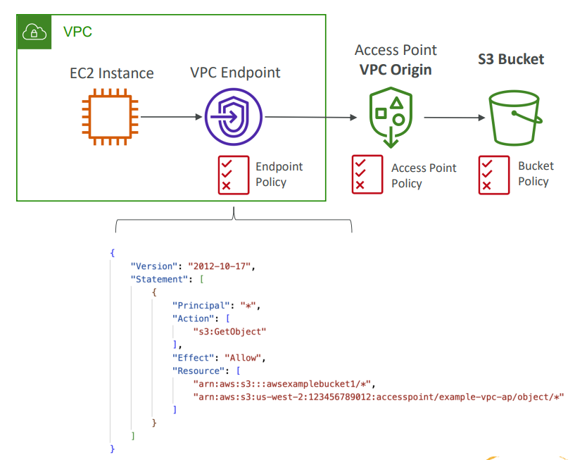

# Storage in AWS

## Amazon S3

- Amazon S3 is one of the main building blocks of AWS.
- It's advertised as 'infinitely scaling' storage.

### Use Cases
- Backup and Storage
- Disaster Recovery
- Archive
- Hybrid Cloud Storage
- Application Hosting
- Media Hosting
- Data Lakes and Big Data Analytics
- Software Delivery
- Static Website
- Nasdaq stores 7 years of data into S3 Glacier 

### Amazon S3 - Buckets

- Amazon S3 allows storing objects(files) in buckets(directories)
- Buckets must have a globally unique name(across all regions all accounts)
- Buckets are defined at region level.
- S3 looks like a global service, but buckets are created in a region.
- Naming convention:
  - No uppercase, No underscore
  - 3–63 characters long
  - Not an IP
  - Must start with a lowercase letter or number
  - Must NOT start with prefix xn--
  - Must NOT end with the suffix -s3alias

### Amazon S3 - Objects

- Objects (files) have a key.
- The key is the FULL path. It consists of "prefix" + object name:
  - s3://my-bucket/my_file.txt
  - s3://my-bucket/my_folder/another_folder/my_file.txt
- There;s no concept of "directories" within buckets. Just keys with very long names that contain ("/")
- Object values are the content of the body:
  - Max object size is 5TB.
  - If uploading more than 5TB, must use "multipart upload"
- Metadata (list of text key / value pairs - system or user metadata)
- Tags (Unicode key / value pair—up to 10): Useful for security/lifecycle.
- Version ID (If Versioning is enabled)

### Amazon S3 — Security

- User-Based: IAM Policies-Which API calls should be allowed for a specific user from IAM.
- Resource Based:
  - Bucket Policies: Bucket wide rules from S3 console—allows cross-account.
  - Object Access Control List (ACL): Finer grain(can be disabled)
  - Bucket Access Control List (ACL): Less common(can be disabled)
- An IAM principal can access an S3 object if:
  - The user IAM permissions ALLOW it OR the resource policy ALLOWS it.
  - AND there's no explicit DENY.
- Encryption: Encrypt objects in S3 using encryption keys.
- Bucket Policies:
  - JSON-based Policies
    - Resources: Buckets and Objects
    - Effect: Allow/Deny
    - Actions: Set of API to Allow or Deny
    - Principal: The account or user to apply the policy to.
  - Use S3 bucket for policy to:
    - Grant public access to the bucket.
    - Force objects to be encrypted at upload.
    - Grant access to another account (Cross Account)
  - Bucket settings for Block Public Access
    - These settings were created to prevent company data leaks.
    - Can be set at the account level.

### Amazon S3 - Versioning

- We can version out files in S3.
- It is enabled at the bucket level.
- The Same key overwriting will change the "version."
- Any file that is not versioned prior to enabling versioning will have version "null."
- Suspending versioning does not delete the previous versions.
- Amazon S3 - Replication (CRR & SRR):
  - Must enable Versioning in source and destination buckets.
  - Buckets can be in different AWS accounts.
  - Copying is synchronous.
  - Must give proper IAM permissions to S3.
  - Cross-Region Replication(CRR): Compliance, lower latency access, replication across accounts.
  - Same-Region Replication(SRR): Log aggregation, Live replication between production and test accounts.
  - After enabling Replication, only new objects are replicated.
  - Optionally, we can replicate existing objects using S3 Batch Replication. It will replicate existing objects and objects that failed replication.
  - There's no chaining of replication.

### Amazon S3 - Storage Classes

- S3 Durability:
  - High Durability (99.999999999%, 11 9's) of objects across multiple AZ
  - If 10 Million objects are stored with Amazon S3, we can on average expect to incur a loss of a single object once every 10,000 years.
- Availability:
  - Measures how readily available a service is.
  - Varies depending on storage class.
  - S3 standard has 99.99% availability: Not available 53 minutes a year.
- Amazon S3 Standard - General Purpose
  - 99.99 % Availability
  - Used for frequently accessed data.
  - Low latency and high throughput.
  - Sustain 2 concurrent facility failures.
  - Use cases: Big Data Analytics, Mobile & Gaming Applications, Content Distribution...
- Amazon S3 Standard-Infrequent Access (IA)
  - For data that is less frequently accessed, but requires rapid access when needed.
  - Lower cost than S3 Standard.
  - 99.9% Availability.
  - Use Case: Disaster Recovery, Backups
- Amazon S3 One Zone-Infrequent Access
  - High Durability in a single AZ. Data lost when AZ is destroyed.
  - 99.5% Availability.
  - Use case: Storing Secondary backup copies of on-premise data, or we can recreate.
- Amazon S3 Glacier Storage Classes:
  - Low-Cost Object Storage meant for archiving/backup.
  - Pricing: Price for Storage + Object Retrieval Cost.
    - Amazon S3 Glacier Instant Retrieval
      - Millisecond retrieval, great for data accessed once a quarter.
      - Minimum storage duration of 90 days.
    - Amazon S3 GLacier Flexible Retrieval
      - Expedited (1 to 5 minutes), Standard (3 to 5 hours), Bulk (5 to 12 hours)
    - Amazon S3 Glacier Deep Archive
      - Standard (12 hours), Bulk (48 hours)
      - Minimum storage duration of 90 days.
- Amazon S3 Intelligent Tiering
  - Small monthly monitoring and auto-tiering are free.
  - Moves objects automatically between Access tiers based on usage.
  - There are no retrieval charges in S3 intelligent-tiering.
    - Frequent Access tier (automatic): default tier
    - Infrequent Access tier (automatic): objects not accessed for 30 days.
    - Archive Instant Access tier (automatic): objects not accessed for 90 days.
    - Archive Access tier (optional): Configurable from 90 days to 700+ days.
    - Deep Archive Access tier (optional): Configurable from 180 days to 700+ days.

### Amazon S3 - Moving between Storage Class

- We can transition objects between storage classes.
- For infrequently accessed objects, move them to Standard IA.
- For archive objects that we don't need fast access to, move them to Glacier or Glacier Deep Archive.
- Moving objects can be automated using a Lifecycle Rules.
- Lifecycle Rules:
  - Transition Actions: Configure objects to transition to another storage class
    - Move objects to Standard IA class 60 days after creation.
    - Move to Glacier for archiving after 6 months.
  - Expiration Actions: Configure objects to expire (delete) after some time.
    - Access log files can be set to delete after 365 days.
    - It Can be used to delete old versions of files.
    - It Can be used to delete incomplete Multi-Part uploads.
  - Rules can be created for certain prefix.
  - Rules can be created for certain objects Tags.
- Amazon S3 Analytics: Storage Class Analysis
  - Helps us decide when to transition objects to the right class.
  - Recommendations for Standard and Standard IA. It Does not work for One-Zone IA or Glacier.
  - The Report is Updated Daily.

### S3 - Baseline Performance

- S3 automatically scales to high request rates, latency 100–200 ms.
- Our Application can achieve at least 3500 PUT/COPY/POST/DELETE or 5500 GET/HEAD requests per second per prefix in bucket.
- There are no limits to the number of prefixes in a bucket.
- Multi-Part Upload:
  - Recommended for files > 100MB
  - Must use fo files >5GB
  - Can help parallelize uploads.
- S3 Transfer Acceleration:
  - Increase transfer speed by transferring file to an AWS edge location which will forward the data to the S3 bucket in the target region.
  - Compatible with multipart upload.
- S3 Byte-Range Fetches
  - Parallelize GETs by requesting specific byte range.
  - Better resilience in case of failures.
  - It Can be used to speed up downloads.
  - It Can be used to retrieve only partial data (e.g head of file)
- S3 Select & Glacier Select
  - Retrieve less data using SQL by performing server-side filtering.
  - Can filter by rows & columns (simple SQL statements)
  - Less network transfer, less CPU cost client-side.

### Amazon S3 - Object Encryption

- There are 4 methods of encryption
  - Server-Side Encryption (SSE)
    - **Server-Side Encryption with Amazon S3-Managed Keys (SSE-S3)** - Enabled by default. Encrypt S3 objects using keys handled, managed, and owned by AWS.
    - **Server-Side Encryption with KMS keys stored in AWS KMS (SSE-KMS)**. Leverage AWS Key Management Service to manage encryption keys.
    - **Server-Side Encryption with Customer-Provided Keys (SSE-C)**. It is used when we want to manage our own encryption keys.
  - Client-Side Encryption

#### SSE-S3

- Encryption using keys handled, managed, and owned by AWS.
- Object is encrypted server-side.
- Encryption type is AES-256.
- Must set header "x-amz-server-side-encryption": "AES256"
- Enabled by default for new buckets & new objects.

#### SSE-KMS

- Encryption using keys handled and managed by AWS KMS.
- KMS advantages: User Control + Audit Key usage using CloudTrail.
- Object is encrypted server side.
- Must set header "x-amz-server-side-encryption": "aws:kms".
- If we use SSE-KMS, we may be impacted by the KMS limits.
- When we upload, it calls the **GenerateDataKey** KMS API.
- When we download, it calls **Decrypt** KMS API.
- Count towards the KMS quota per second (5500, 10000, 30000 req/s based on region)
- Service Quotas Console can be used to request quota increase.

#### SSE-C

- Server-Side Encryption using keys fully managed by the customer outside AWS.
- Amazon S3 does NOT store the encryption key we provide.
- HTTPS must be used.
- Encryption key must provide in HTTP headers, for every HTTP request made.

#### Client-Side Encryption

- Use client libraries such as Amazon S3 Client-Side Encryption Library.
- Clients must encrypt data themselves before sending to Amazon S3.
- Clients must decrypt data themselves when retrieving from Amazon S3.
- The Customer fully manages the keys and encryption cycle.

#### Encryption in Transit(SSL/TLS)

- Encryption in flight is also called SSL/TLS.
- Amazon S3 exposes two endpoints:
  - HTTP Endpoint: Non-Encrypted.
  - HTTPS Endpoint: Encryption in flight.
- HTTPS is recommended.
- HTTPS is mandatory for SSE-C.

### S3 - Default Encryption vs. Bucket Policies.

- SSE-3 encryption is automatically applied to new objects stored in S3 bucket.
- Optionally, we can "force encryption" using a bucket policy and refuse any API call to PUT an S3 object without encryption headers.
- Bucket Policies are evaluated before "Default Encryption."

### S3—Access Points.

- Access Points simplify security management for S3 Buckets.
- Each Access Point has:
  - Its own DNS name (Internet Origin or VPC)
  - AN Access Point Policy (Similar to bucket policy) - manage security at scale.
- VPC Origin
  - We can define the access point to be accessible only from within the VPC.
  - We must create a VPC endpoint to access the Access Point (Gateway or Interface Endpoint)
  - The VPC Endpoint Policy must allow access to the target bucket and Access Point.

### S3 Object Lambda

- Use AWS Lambda functions to change the object before it is retrieved by the caller application
- Only one S3 bucket is needed, on top of which we create S3 Access Point and S3 Object Lambda Access Points.

## EBS (Elastic Block Store)

- EBS Volume is a network drive we can attach to our instances while they run.
- It allows our instances to persist data, even after their termination.
- They can only be mounted to one instance at a time.
- They are bound to a specific availability zone.
- It can be considered as 'network USB stick.'
- It uses the network to communicate the instance, which means there might be a bit of latency.
- It can be detached from an EC2 instance and attached to another one quickly.
- 