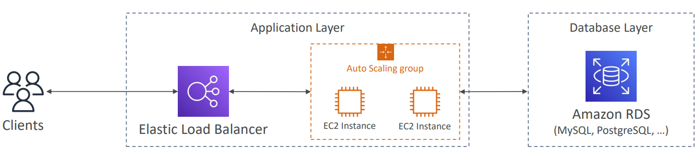

# Database

Traditional Architecture

- Traditional Application leverages RDBMS databases.
- These databases have SQL query language.
- Strong requirements about how the data should be modeled.
- Ability to do query joins, aggregations, complex computations.
- Vertical Scaling (getting a more powerful CPU/RAM/IO)
- Horizontal Scaling (increasing reading capability by adding EC2/RDS Read Replicas)

## DynamoDB

- Fully managed, highly available with replication across multiple AZs.
- NoSQL database - not a relational database.
- Scales to massive workloads, distributed database.
- Millions of requests per second, trillions of rows, 100s TB of storage.
- Fast and consistent in performance (low latency on retrieval)
- Integrated with IAM for security, authorization and administration.
- Enables event driven programming with DynamoDB Streams.
- Low cost and auto-scaling capabilities.
- Standard & Infrequent Access Table class.
- DynamoDB is made of Tables.
- Each table has a Primary Key (must be decided at creation time)
- Each table can have an infinite number of items (=rows).
- Each item has attributes (can be added over time—can be null)
- Maximum size of an item is 400KB
- Data types supported:
  - Scalar types: String, Number, Binary, Boolean, Null
  - DocumentTypes: List, Map
  - Set Types: String Set, Number Set, Binary Set.
- Primary Keys:
  - Option 1: Partition Key (HASH)
    - Partition Key must be unique for each item.
    - Partition key must be "diverse" so that the data is distributed.
    - Example: "User_ID" for a users table.
  - Option 2: Partition Key + Sort Key (HASH + RANGE)
    - Combination must be unique for each item.
    - Data is grouped by partition key.
    - Example: users-game table, "User_ID" for Partition Key and "Game_ID" for Sort Key.
- Exercise:
  - Suppose you are building a movie database. What is the best partition key to maximize data distribution?
    - movie_id
    - producer_name
    - leader_actor_name
    - movie_language
- DynamoDB in Big Data Use cases:
  - Mobile Apps.
  - Gaming.
  - Digital Ad Serving.
  - Live Voting.
  - Audience Interaction for live events.
  - Sensor Networks.
  - Log Ingestion.
  - Access Control for Web-based content.
  - Metadata storage for Amazon S3 objects.
  - E-commerce shopping carts.
  - Web session management.

### Throughput (RCU & WCU)

- Controls how we manage our table's capacity (read/write throughput)
- Provisioned Mode (default)
  - We specify the number of reads/writes per second.
  - We need to plan capacity beforehand.
  - Pay for provisioned read & write capacity units.
- On-Demand Mode
  - Read/ write automatically scale up/down with your workloads.
  - No capacity planning needed.
  - Pay for what we use, more expensive.

#### R/W Capacity Modes-Provisioned

- Tables must have provisioned read and write capacity units.
- Read Capacity Units (RCU): Throughput for reads.
- Write Capacity Units (WCU): Throughput for write.
- Option to set up *auto-scaling* of throughput to meet demand.
- Throughput can be exceeded temporarily using **Burst Capacity**.
- If Burst Capacity has been consumed, we will get a **ProvisionedThroughputExceededException**

#### DynamoDB - Write Capacity Units (WCU)

- One *Write Capacity Unit(WCU)* represents one write per second for an item up to 1 KB in size.
- If the items are larger than 1 KB, more WCUs are consumed.
- Examples:
  - we write 10 items per second, with item size 2 KB, we need 10 * (2 KB/1 KB) = 20 WCUs
  - we write 6 items per second, with item size 4.5 KB, we need 6 * (5 KB/1 KB) = 30 WCUs
  - we write 120 items per minute, with item size 2 KB, we need (120/60) * (2 KB/ 1 KB) = 4 WCUs.

#### Strongly consistent Read vs Eventually Consistent Read

- Eventually Consistent Read (default)
  - If we read after a write, it's possible we will get some stale data because of replication.
- Strongly Consistent Read.
  - If we read after a write, we will get the correct data.
  - Set **ConsistentRead** parameter to **True** in API calls (GetItem, BatchGetItem, Query, Scan)
  - Consumes twice the RCU.

#### DynamoDB - Read Capacity Units (RCU)

- One *Read Capacity Unit (RCU)* represents one Strongly Consistent Read per second, or two Eventually Consistent Reads per second, for an item up to 4 KB in size.