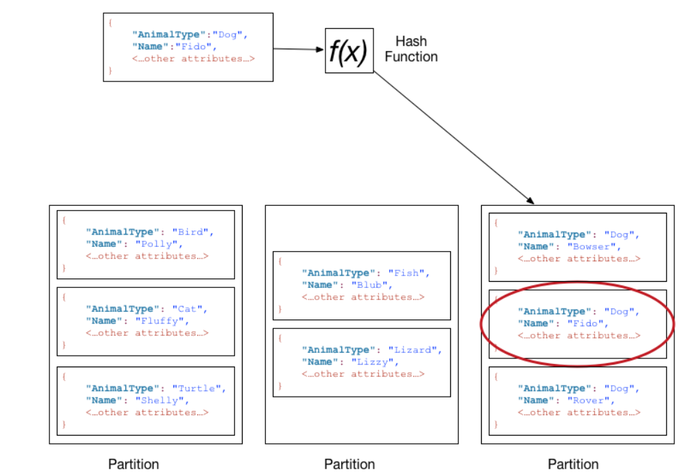
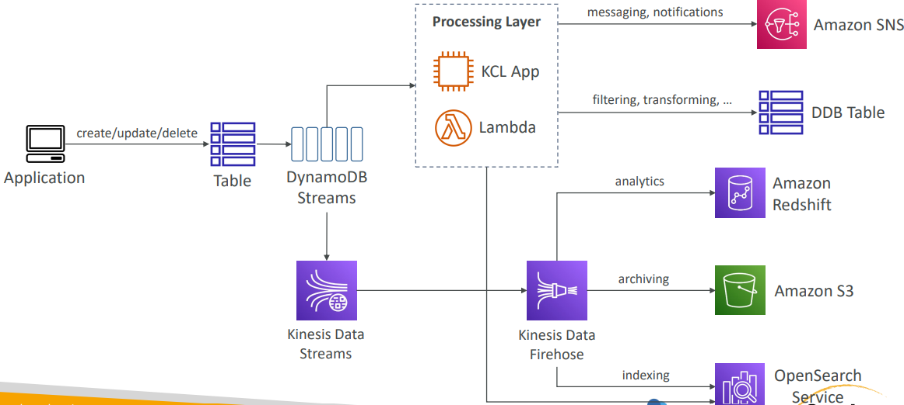
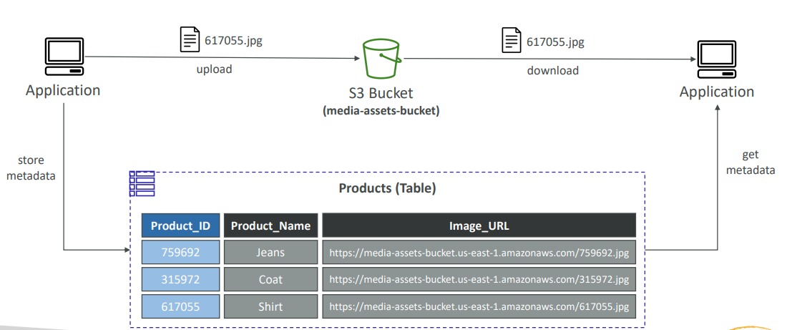
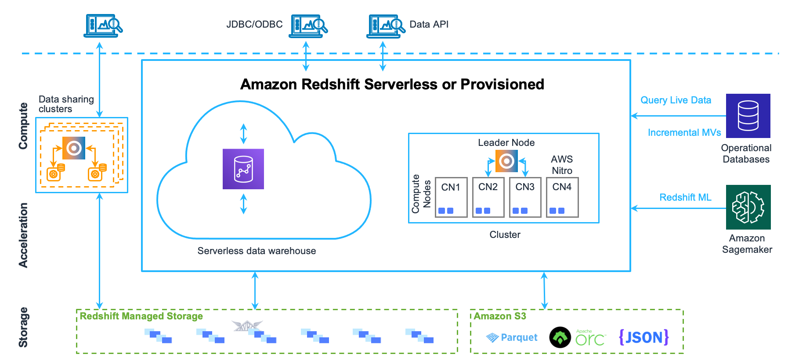
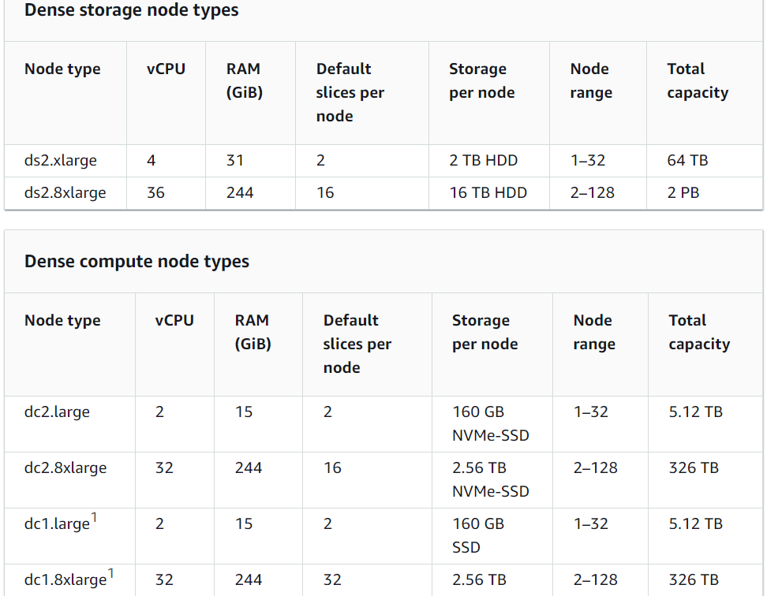
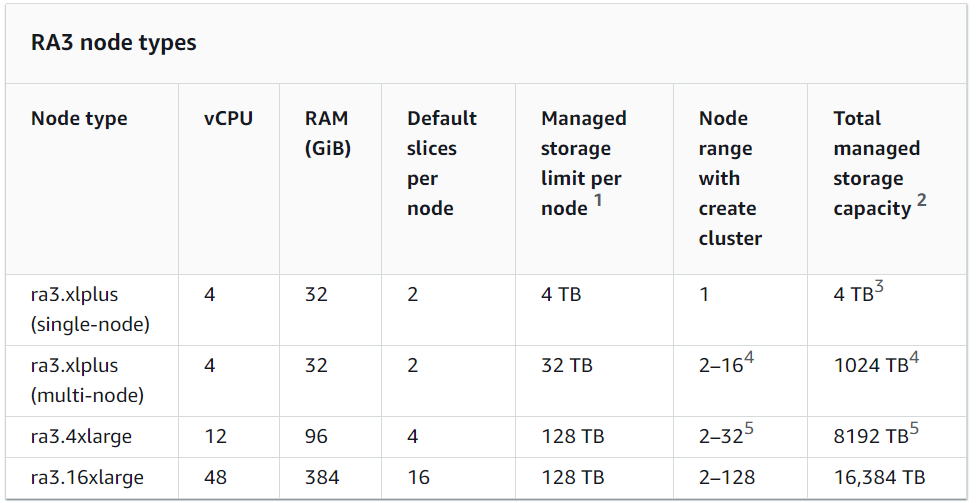

# Database

Traditional Architecture


- Traditional Application leverages RDBMS databases.
- These databases have SQL query language.
- Strong requirements about how the data should be modeled.
- Ability to do query joins, aggregations, complex computations.
- Vertical Scaling (getting a more powerful CPU/RAM/IO)
- Horizontal Scaling (increasing reading capability by adding EC2/RDS Read Replicas)

## DynamoDB

- Fully managed, highly available with replication across multiple AZs.
- NoSQL database - not a relational database.
- Scales to massive workloads, distributed database.
- Millions of requests per second, trillions of rows, 100s TB of storage.
- Fast and consistent in performance (low latency on retrieval)
- Integrated with IAM for security, authorization and administration.
- Enables event driven programming with DynamoDB Streams.
- Low cost and auto-scaling capabilities.
- Standard & Infrequent Access Table class.
- DynamoDB is made of Tables.
- Each table has a Primary Key (must be decided at creation time)
- Each table can have an infinite number of items (=rows).
- Each item has attributes (can be added over time—can be null)
- The Maximum size of an item is 400KB
- Data types supported:
  - Scalar types: String, Number, Binary, Boolean, Null
  - DocumentTypes: List, Map
  - Set Types: String Set, Number Set, Binary Set.
- Primary Keys:
  - Option 1: Partition Key (HASH)
    - Partition Key must be unique for each item.
    - Partition key must be "diverse" so that the data is distributed.
    - Example: "User_ID" for a users table.
  - Option 2: Partition Key + Sort Key (HASH + RANGE)
    - Combination must be unique for each item.
    - Data is grouped by partition key.
    - Example: users-game table, "User_ID" for Partition Key and "Game_ID" for Sort Key.
- Exercise:
  - Suppose you are building a movie database. What is the best partition key to maximize data distribution?
    - movie_id
    - producer_name
    - leader_actor_name
    - movie_language
- DynamoDB in Big Data Use cases:
  - Mobile Apps.
  - Gaming.
  - Digital Ad Serving.
  - Live Voting.
  - Audience Interaction for live events.
  - Sensor Networks.
  - Log Ingestion.
  - Access Control for Web-based content.
  - Metadata storage for Amazon S3 objects.
  - E-commerce shopping carts.
  - Web session management.

### Throughput (RCU & WCU)

- Controls how we manage our table's capacity (read/write throughput)
- Provisioned Mode (default)
  - We specify the number of reads/writes per second.
  - We need to plan capacity beforehand.
  - Pay for provisioned read & write capacity units.
- On-Demand Mode
  - Read/ write automatically scale up/down with your workloads.
  - No capacity planning needed.
  - Pay for what we use, more expensive.

#### R/W Capacity Modes-Provisioned

- Tables must have provisioned read and write capacity units.
- Read Capacity Units (RCU): Throughput for reads.
- Write Capacity Units (WCU): Throughput for write.
- Option to set up *auto-scaling* of throughput to meet demand.
- Throughput can be exceeded temporarily using **Burst Capacity**.
- If Burst Capacity has been consumed, we will get a **ProvisionedThroughputExceededException**

#### DynamoDB - Write Capacity Units (WCU)

- One *Write Capacity Unit(WCU)* represents one write per second for an item up to 1 KB in size.
- If the items are larger than 1 KB, more WCUs are consumed.
- Examples:
  - we write 10 items per second, with item size 2 KB, we need 10 * (2 KB/1 KB) = 20 WCUs
  - we write 6 items per second, with item size 4.5 KB, we need 6 * (5 KB/1 KB) = 30 WCUs
  - we write 120 items per minute, with item size 2 KB, we need (120/60) * (2 KB/ 1 KB) = 4 WCUs.

#### Strongly consistent Read vs Eventually Consistent Read

- Eventually Consistent Read (default)
  - If we read after a write, it's possible we will get some stale data because of replication.
- Strongly Consistent Read.
  - If we read after a write, we will get the correct data.
  - Set **ConsistentRead** parameter to **True** in API calls (GetItem, BatchGetItem, Query, Scan)
  - Consumes twice the RCU.

#### DynamoDB - Read Capacity Units (RCU)

- One *Read Capacity Unit (RCU)* represents one Strongly Consistent Read per second, or two Eventually Consistent Reads per second, for an item up to 4 KB in size.
- If the items are larger than 4 KB, more RCUs are consumed.
- Example: 
  - 10 Strongly Consistent Reads Per Second, with item size 4 KB we need 10 * (4 KB/4 KB) = 10 RCUs.
  - 16 Eventually Consistent Reads per second, with item size 12 KB we need (16/2) * (12 KB / 4 KB) = 24 RCUs
  - 10 Strongly Consistent Reads per second, with item size 6 KB, we need 10 * (8 KB / 4 KB) = 20 RCUs.

### DynamoDB—Partitions Internal

- Data is stored in partitions.
- Partition Keys go through a hashing algorithm to known to which partition they go to.
- To compute the number of partitions:
  - No. of partitions by capacity = (Total RCUs/3000) + (Total WCUs/1000)
  - No. of partitions by size = Total size/10GB
  - No. of partitions = ceil(max(No. of partitions by capacity, No. of partitions by size))
- WCUs and RCUs are spread evenly across partitions.



### Throttling

- If we exceed provisioned RCUs or WCUs, we get "ProvisionedThroughputExceededException"
- Reasons:
  - Hot keys: One partition key is being read too many times.
  - Hot partitions.
  - Very large items, remember RCU and WCU depend on the size of items.
- Solutions:
  - Exponential backoff when exception is encountered.
  - Distribute partition keys as much as possible.
  - If RCU issue, we can use DynamoDB Accelerator (DAX).

### R/W Capacity Modes: On-Demand

- Read/Write automatically scale up/down with our workloads.
- No capacity planning needed.
- Unlimited WCU & RCU, no throttle, more expensive.
- Charge is as per reads/writes that we use in terms of RRU and WRU.
- Read Request Units (RRU): Throughput for reads (same as RCU).
- Write Request Units (WRU): Throughput for writes (same as WCU).
- 2.5x more expensive than provisioned capacity.
- Use cases: Unknown workloads, unpredictable application traffic...

### Basic APIs

#### Writing Data

- PutItem
  - Creates a new item or fully replace an old item (same Primary Key).
  - Consumes WCUs.
- UpdateItem
  - Edits an existing item's attributes or adds a new item if it doesn't exist.
  - Can be used to implement Atomic Counters - a numeric attribute that's unconditionally incremented.
- Conditional Writes
  - Accept a write/update/delete only if conditions are met, otherwise return an error.
  - Helps with concurrent access to items.
  - No performance impact.

#### Reading Data

- GetItem
  - Read based on Primary Key.
  - Primary key can be HASH or HASH+RANGE.
  - Eventually Consistent Read (default)
  - Option to use Strongly Consistent Reads (more RCU - might take longer)
  - ProjectionExpression can be specified to retrieve only certain attributes.
- Query returns items based on:
  - **KeyConditionExpression**
    - Partition Key value - required
    - Sort Key value - optional
  - **FilterExpression**
    - Additional filtering after the Query operation.
    - Use only with non-key attributes. (does not allow HASH or RANGE attributes)
  - Returns:
    - The number of items specified in *Limit*
    - Or up to 1 MB of data.
  - Ability to do pagination on the results.
  - Can query table, a Local Secondary Index, or a Global Secondary Index.
- Scan
  - Scan the entire table and then filter out data.
  - Returns up to 1 MB of data - use pagination to keep on reading.
  - Consumes a lot of RCU.
  - Limit impact using *Limit* or reduce the size of the result and pause.
  - For faster performance, use *Parallel Scan*
    - Multiple workers scan multiple data segments at the same time.
    - Increases the throughput and RCU consumed.
    - Limit the impact of parallel scans just like we would for Scans.
  - Can use **ProjectionExpression** & **FilterExpression** (no changes to RCU)

#### Deleting Data

- **DeleteItem**
  - Delete an individual item.
  - Ability to perform a conditional delete.
- **DeleteTable**
  - Delete a whole table and all its items.
  - Much quicker deletion than calling **DeleteItem** on all items.

#### Batch Operations

- Allows us to save latency by reducing the number of API calls.
- Operations are done in parallel for efficiency.
- Part of batch can fail; in which case we need to try again for the failed items.
- **BatchWriteItem**
  - Up to 25 **PutItem** and/or **DeleteItem** in one call.
  - Up to 16 MB of data written, up to 400 KB of data per item.
  - Can't update items (Use **UpdateItem**)
  - **UnprocessedItems** for failed write operations.
- **BatchGetItem**
  - Returns items from one or more tables.
  - Up to 100 items, up to 16 MB of data.
  - Items are retrieved in parallel to minimize latency.
  - **UnprocessedKeys** for failed read operations.

#### PartiQL

- SQL-compatible query langauge for DynamoDB.
- Allows us to select, insert, update, and delete data in DynamoDB using SQL.
- Run queries across multiple DynamoDB tables.
- Run PartiQL queries from:
  - AWS Management Console.
  - NoSQL Workbench for DynamoDB.
  - DynamoDB APIs.
  - AWS CLI.
  - AWS SDK.

### Indexes in DynamoDB

- Local Secondary Index (LSI)
  - Alternative Sort Key for our table (same *Partition Key* as that of base table.)
  - The Sort Key consists of one scalar attribute (String, Number, or Binary)
  - Up to 5 Local Secondary Indexes per table.
  - Must be defined at table creation time.
  - Attribute Projections: Can contain some or all the attributes of the base table.
- Global Secondary Index (GSI)
  - Alternative Primary Key (HASH or HASH+RANGE) from the base table.
  - Speed up queries on non-key attributes.
  - The Index Key consists of scalar attributes.
  - Attribute Projections: Some or all the attributes of the base table.
  - Must provision RCUs & WCUs for the index.
  - Can be added/modified after table creation.
  - If the writes are throttled on the GSI, then the main table will be throttled, Even if the WCU on the main tables are fine.

### DynamoDB Accelerator (DAX)

- Fully-managed, highly available, seamless in-memory cache for DynamoDB.
- Microseconds latency for cached reads & queries.
- Doesn't require application logic modification. (Compatible with existing DynamoDB APIs)
- Solves the "Hot Key" problem.
- 5 minutes TTL for cache.
- Up to 10 nodes in the cluster.
- Multi-AZ (3 nodes minimum recommended for production)
- Secure (Encryption at rest with KMS, VPC. IAM, CloudTrail,...)

### DynamoDB Streams



- Ordered Stream of item-level modifications (create/update/delete) in a table.
- Stream Records can be:
  - Sent to *Kinesis Data Streams*.
  - Read by *AWS Lambda*.
  - Read by *Kinesis Client Library Applications*
- Data Retention for up to 24 hours.
- Use cases:
  - React to changes in real-time.
  - Analytics.
  - Insert into derivative tables.
  - Insert into OpenSearch Service.
  - Implement cross-region replication.
- Ability to choose the information that will be written to the stream:
  - KEYS_ONLY: Only the key attributes of the modified item.
  - NEW_IMAGE: The entire item, as it appears after it was modified.
  - OLD_IMAGE: The entire item, as it appeared before it was modified.
  - NEW_AND_OLD_IMAGES: Both the new and old images of the item.
- DynamoDB Streams are made of shards, just like Kinesis Data Streams.
- We don't provision shards, it is automated by AWS.
- Records are not retroactively populated in a stream after enabling it.
- DynamoDB Streams & AWS Lambda:
  - We need to define an *Event Source Mapping* to read from a DynamoDB Streams.
  - We need to ensure the Lambda Function has the appropriate permissions.
  - Lambda Function is invoked synchronously.

### DynamoDB - Time To Live (TTL)

- Automatically delete items after an expiry timestamp.
- Doesn't consume any WCUs (no extra cost).
- The TTL attribute must be a "Number" data type with "Unix Epoch timestamp" value.
- Expired items deleted within 48 hours of expiration.
- Expired items that haven't been deleted, appears in reads/queries/scans.
- A delete operation for each expired item enters the DynamoDB Streams.
- Use cases: Reduce Stored data by keeping only current items, adhere to regulatory obligations...

### DynamoDB with S3

- Large Objects Pattern




### Security and other features

- Security
  - VPC Endpoints available to access DynamoDB without using the internet.
  - Access fully controlled by IAM.
  - Encryption at rest using AWS KMS and in-transit using SSL/TLS.
- Backup and Restore Features
  - Point-in-time Recovery (PITR) like RDS.
  - No performance impact
- Global Tables
  - Multi-region, multi-active, fully replicated, high performance.
- DynamoDB Local
  - Develop and test apps locally without accessing the DynamoDB web service.
- AWS Database Migration Service (AWS DMS) can be used to migrate to DynamoDB (from MongoDB, Oracle, MySQL, S3,...)
- Fine-Grained Access Control:
  - Using Web Identity Federation or Cognito Identity Pools, each user gets AWS credentials.
  - Assign an IAM Role to users with a Condition to limit there API access.
  - **LeadingKeys**: Limit row-level access for users.
  - **Attributes**: Limit specific attributes the user can see.
```
{
   "Version":"2012-10-17",
   "Statement":[
      {
         "Sid":"AllowAccessToOnlyItemsMatchingUserID",
         "Effect":"Allow",
         "Action":[
            "dynamodb:GetItem",
            "dynamodb:BatchGetItem",
            "dynamodb:Query",
            "dynamodb:PutItem",
            "dynamodb:UpdateItem",
            "dynamodb:DeleteItem",
            "dynamodb:BatchWriteItem"
         ],
         "Resource":[
            "arn:aws:dynamodb:us-west-2:123456789012:table/GameScores"
         ],
         "Condition":{
            "ForAllValues:StringEquals":{
               "dynamodb:LeadingKeys":[
                  "${www.amazon.com:user_id}"
               ],
               "dynamodb:Attributes":[
                  "UserId",
                  "GameTitle",
                  "Wins",
                  "Losses",
                  "TopScore",
                  "TopScoreDateTime"
               ]
            },
            "StringEqualsIfExists":{
               "dynamodb:Select":"SPECIFIC_ATTRIBUTES"
            }
         }
      }
   ]
}
```

## Amazon RDS(Relational Database Service)

- Hosted Relational Database
  - Amazon Aurora
  - MySQL
  - PostgreSQL
  - MariaDB
  - Oracle
  - SQL Server
- Not for "big data"
- RDS databases offer full ACID compliance.

### Amazon Aurora

- MySQL and PostgreSQL - compatible
- Up to 5X faster than MySQL, 3X faster than PostgreSQL
- 1/10 the cost of commercial database.
- Up to 128TB per database volume.
- Up to 15 read replicas.
- Continuous backup to S3.
- Replications across regions and Availability Zones.
- Automatic scaling with Aurora Serverless.
- VPC network isolation.
- At-rest with KMS. In-transit with SSL.

### RDS Operational Guidelines

- Use CloudWatch to monitor memory, CPU, storage, replica log.
- Perform automatic backups during daily low in write IOPS.
- Insufficient I/O will make recovery after failure slow.
  - Migrate to DB instance with more I/O.
  - Move to General Purpose or Provisioned IOPS Storage.
- Set TTL on DNS for your DB instances to 30 seconds or less from your apps.
- Test fail over before we need it.
- Provision enough RAM to include our entire working set.
- Rate limits in Amazon API Gateway can be used to protect our database.
- Use Indexes to accelerate SELECT statements.
- Avoid full table scans.
- Use ANALYZE TABLE periodically.
- Simplify WHERE clauses.

## DocumentDB

- DocumentDB is the same for MongoDB.
- MongoDB is used to store, query, and index JSON data.
- Similar *deployment concepts* as Aurora.
- Fully managed, highly available with replication across 3 AZ.
- DocumentDB storage automatically grows in increments of 10GB.
- Automatically scales to workloads with millions of requests per seconds.

## Amazon MemoryDB for Redis

- Redis-compatible, durable, in-memory database service.
- Ultra-fast performance with over 160 millions requests/second.
- Durable in-memory data storage with Multi-AZ transactional log.
- Scale seamlessly from 10s GBs to 100s TBs of Storage.
- Use cases: Web and Mobile Apps, Online Gaming, Media Streaming,...

## Amazon Keyspaces (for Apache Cassandra)

- Apache Cassandra is an open-source NoSQL distributed database.
- A managed Apache Cassandra-compatible database services.
- Serverless, Scalable, highly available, fully managed by AWS.
- Automatically scale tables up/down based on the application's traffic.
- Tables are replicated 3 times across multiple AZ.
- Using the Cassandra Query Language (CQL)
- Single-digit millisecond latency at any scale, 1000s of requests per second.
- Capacity: On-demand mode or provisioned mode with auto-scaling.
- Encryption, backup, Point-In-Time Recovery (PITR) up to 35 days.
- Use cases: Store IoT devices info, time-series data...


## Amazon Neptune

- Fully managed graph database.
- A popular graph dataset would be a social network
- Highly available across 3 AZ, with up to 15 read replicas.
- Build and run applications working with highly connected datasets—optimized for these complex and hard queries.
- Can store up to billions of relations and query the graph with millisecond latency.
- Highly available with replications across multiple AZs.
- Great for knowledge graphs, fraud detection, recommendation engines, social networking.


## Amazon Redshift

- Fully managed, petabyte-scale data warehouse.
- 10X better performance than other DW's.
  - Via Machine Learning, Massively Parallel Query Execution, Columnar Storage.
- Designed for OLAP, not OLTP.
- Cost-effective.
- SQL, ODBC, JDBC interfaces
- Scale up or down on demand.
- Built-in replication & backups.
- Monitoring via CloudWatch/CloudTrail.
- Use Cases:
  - Accelerate Analytics Workload.
  - Unified Data Warehouse & Data Lake.
  - Data Warehouse modernization.
  - Analyze global sales data.
  - Store historical stock trade data.
  - Analyze ad impressions & clicks.
  - Aggregate gaming data.
  - Analyze Social trends.

### Redshift Architecture



- Cluster is a core component of Amazon Redshift Data Warehouse.
- Cluster is composed of Leader nodes and one or more compute nodes. It can contain between 1 and 128 compute nodes.
- Each Cluster can contain one or more databases.
- User data is stored on Compute node.
- Leader node manages communication with the client program and compute nodes.
- Leader node receives query from Client Application and parses the query and develops execution plan then coordinates parallel execution and aggregates the intermediate results from those plans.
- Compute Nodes are responsible for execution the plans developed by Leader nodes and translates data among them to serve those queries.
- It then sends those intermediate results to Leader node for aggregating.
- Each compute node has its dedicated CPU, memory and attached disk storage.
- Two types of Nodes:
  - Dense Storage: Used to create large data warehouse using HDD at low price.
  - Dense Compute Nodes: High Performance Data Warehouse using SDD.

