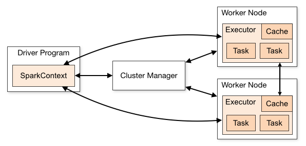
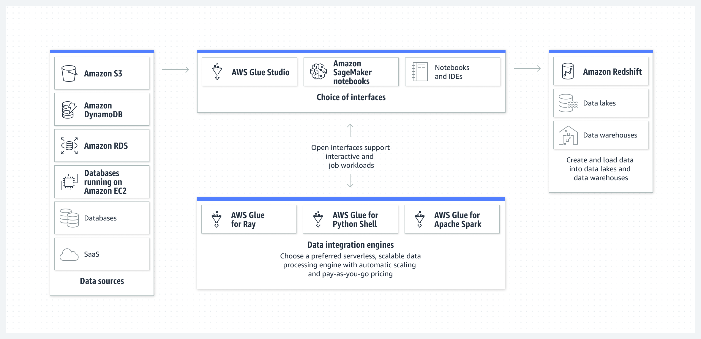
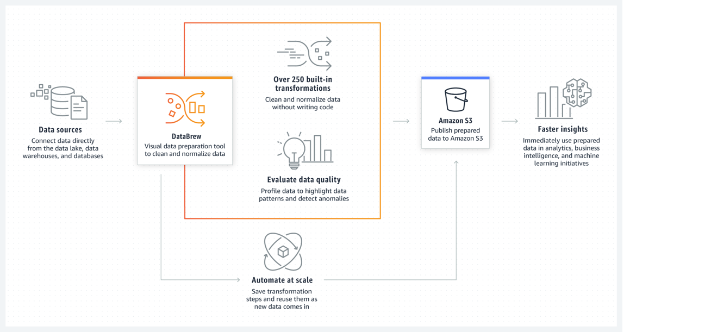
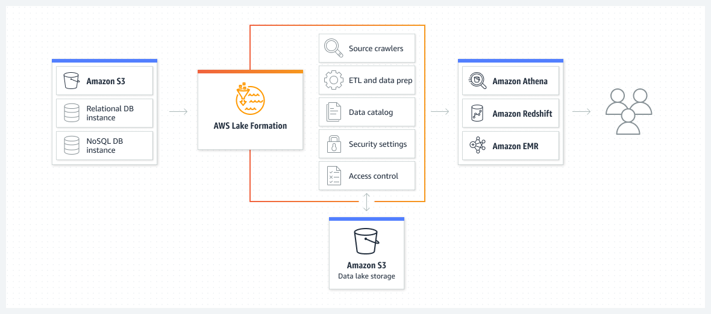
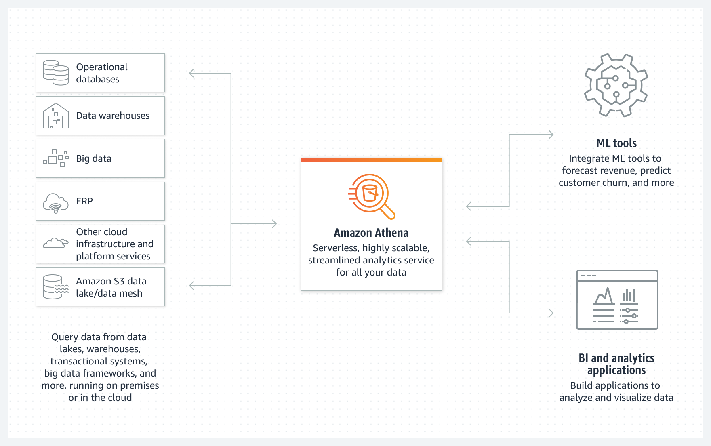
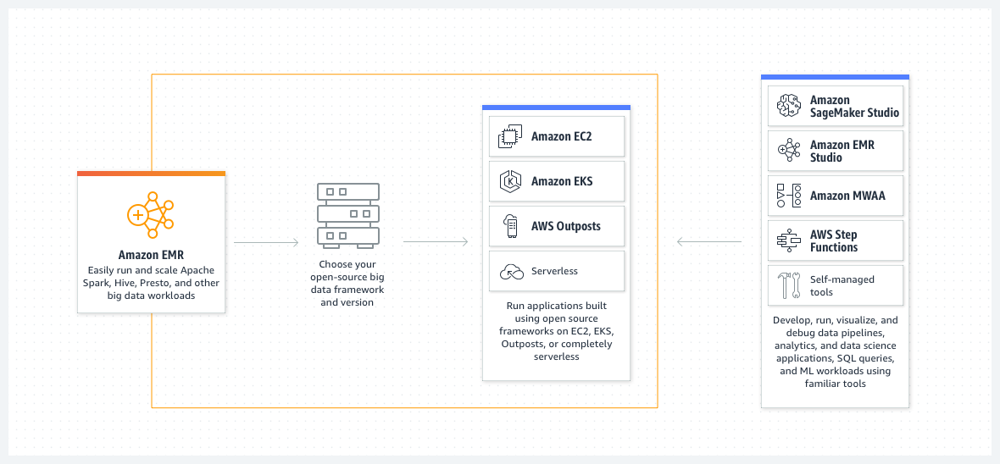

# Analytics in Data Engineering

## Apache Spark



- Distributed processing framework for big data
- In-memory caching, optimized query execution.
- Supports Java, Python, Scala, R
- Supports code reuse across
  - Batch processing.
  - Interactive Queries
    - Spark SQL
  - Real-time Analytics
  - Machine-Learning
    - MLLib
  - Graph Processing
- Spark Streaming
  - Integrated with Kinesis, Kafka, on EMR.
- Spark is NOT meant for OLTP.
- Spark apps are run as independent processes on a cluster.
- The SparkContext (driver program) coordinates them.
- SparkContext works through a Cluster Manager.
- Executors run computations and store data.
- SparkContext sends application code and tasks to executors.
- Spark Components:
  - Spark Core: Memory Management, Fault recovery, Scheduling, distribute & monitor jobs, interact with storage. Scala, Python, Java, R
  - Spark Streaming: Real-time streaming analytics. Structured Streaming. Twitter, Kafka, Flume, HDFS, ZeroMQ.
  - Spark SQL: Up to 100x faster than MapReduce. JDBC, ODBC, JSON, HDFS, ORC, Parquet, HiveQL.
  - MLLib: Classification, Regression, Clustering, Collaborative filtering, Pattern mining. Read from HDFS, HBase...
  - GraphX: Graph Processing, ETL, Analysis, Iterative graph computation.

## AWS Glue



- Serverless discovery and definition of table definitions and schema.
  - S3 'data lakes'
  - RDS
  - Redshift
  - Most other SQL databases
- Custom ETL jobs
  - Trigger-driven, on a schedule or on demand.
  - Fully managed.
- Glue Crawler scans data in S3, creates schema.
- Can run periodically.
- Populates the Glue Data Catalog
  - Stores only table definition.
  - Original data stays in S3.
- Once cataloged, we can treat our unstructured data like its structured.
  - Redshift Spectrum.
  - Athena
  - EMR
  - Quicksight
- Glue crawler will extract partitions based on how our S3 data is organized.
- Think about how we will be querying our data lake in S3.
  - Example: Devices send sensor data every hour. Do we query primarily by time ranges or do we query primarily by device?

### Glue ETL

- Automatic code generation.
- Scala or Python
- Encryption
  - Server-side (at rest)
  - SSL (in transit)
- Can be event-driven.
- Can provision additional "DPUs"(Data Processing Units) to increase the performance of underlying Spark jobs.
- Errors reported to CloudWatch. Could tie into SNS for notification.
- Transform data, Clean Data, Enrich Data
  - Generate ETL code in Python or Scala, we can modify the code.
  - Can provide our own Spark or PySpark scripts.
  - Target can be S3, JDBC (RDS, Redshift) or in Glue Data Catalog.
- Fully managed, cost-effective, pay only for the resources consumed.
- Jobs are run on a serverless Spark Platform
- Glue Scheduler to schedule the jobs.
- Glue Triggers to automated job runs based on events.
- The DynamicFrame:
  - A DynamicFrame is a collection of DynamicRecords
    - DynamicRecords are self-describing, have a schema.
    - Very much like a Spark DataFrame, but with more ETL stuff.
    - Scala and Python APIs.
- Transformations
  - BundledTransformations
    - DropFields, DropNullFields - remove (null) fields
    - Filter — specify a function to filter records
    - Join - to enrich data
    - Map - add fields, delete fields, perform external lookups.
  - Machine Learning Transformations
    - FindMatches ML: Identify duplicate or matching records in your dataset, even when the records do not have common unique identifier and no fields match exactly.
  - Format conversions:CSV, JSON, Avro, Parquet, ORC, XML
  - Apache Spark transformations.
- Modifying the Data Catalog
  - ETL scripts can update our schema and partitions if necessary.
  - Adding new partitions
    - Re-run the crawler
    - Have the script use enableUpdateCatalog and partitionKeys options.
  - Updating table schema
    - Re-run the crawler
    - Use enableUpdateCatalog / updateBehavior from script.
  - Creating new tables
    - enableUpdateCatalog / updateBehavior with setCatalogInfo
  - Restrictions
    - S3 only
    - Json, csv, avro, parquet only
    - Parquet requires special code
    - Nested schemas are not supported

### AWS Glue Development Endpoints
  - Develop ETL scripts using a notebook
    - Then create an ETL job that runs our script (using Spark and Glue)
  - Endpoint is in a VPC controlled by a security groups, connect via:
    - Apache Zeppelin on our local machine
    - Zeppelin notebook server on EC2
    - SageMaker notebook
    - Terminal window
    - PyCharm professional edition
    - Use Elastic IP's to access a private endpoint address.

### Running Glue Jobs

- Time-based schedules (cron style)
- Job bookmarks
  - Persists state from the job run
  - Prevents preprocessing of old data
  - Allows you to process new data only when re-running on a schedule
  - Works with S3 sources in a variety of formats.
  - Works with relational databases via JDBC
- CloudWatch Events
    - Fire off a Lambda function or SNS notification when ETL succeeds or fails
    - Invoke EC2 run, send event to Kinesis, activate a step function.

### AWS Glue Studio

- Visual interface for ETL workflows.
- Visual job editor
  - Create DAG's for complex workflows.
  - Sources include S3, Kinesis, Kafka, JDBC
  - Transform / sample / join data
  - Target to S3 or Glue Data Catalog.
  - Support Partitioning.
- Visual job dashboard
  - Overviews, Status, run times.

### AWS Glue Data Quality

- Data Quality rules may be created manually or recommended automatically.
- Integrates into Glue jobs.
- Use Data Quality Definition Language (DQDL)
- Results can be used to fail the job,or just be reported to CloudWatch.

### Glue DataBrew



- A Visual data preparation tool
  - UI for pre-processing large data sets.
  - Input from S3, data warehouse, or database.
  - Output to S3.
- Over 250 ready-made transformations.
- Create "recipes" of transformations that can be saved as jobs within a larger project.
- May define data quality rules.
- May create datasets with custom SQL from Redshift and Snowflake.
- Security
  - Can integrate with KMS
  - SSL in transit
  - IAM can restrict who can do what
  - CloudWatch & CloudTrail
- Handling Personally Identifiable Information(PII) in DataBrew Transformations.
  - Substitution (REPLACE_WITH_RANDOM..)
  - Shuffling (SHUFFLE_ROWS)
  - Deterministic encryption (DETERMINISTIC_ENCRYPT)
  - Probabilistic encryption (ENCRYPT)
  - Decryption (DECRYPT)
  - Nulling out or deletion (DELETE)
  - Masking out (MASK_CUSTOM, _DATE, _DELIMITER, _RANGE)
  - Hashing (CRYPTOGRAPHIC_HASH)

### Glue Workflows

- Design multi-job, multi-crawler ETL processes run together.
- Create from AWS Glue blueprint, from the console, or API
- This is only for orchestrating complex ETL operations using Glue.
- Triggers within workflows start jobs or crawlers
  - Or can be fired when jobs or crawlers complete.
  - Schedule: Based on a cron expression.
  - On Demand.
  - EventBridge events
    - Start on single event or batch of events
    - E.g., Arrival of a new object in S3.
    - Optional batch conditions
      - Batch size (number of events)
      - Batch window (within X seconds, default is 15 min)

## AWS Lake Formation



- Built on top of Glue.
- "Makes it easy to set up a secure data lake in days."
- Loading data & monitoring data flows.
- Setting up partitions.
- Encryption & managing keys.
- Defining transformation of jobs & monitoring them.
- Access control.
- Auditing.
- The Finer Points:
  - Cross-account Lake Formation permission
    - The Recipient must be set up as a data lake administrator.
    - Can use AWS Resource Access Manager for accounts external to our organization.
    - IAM permissions for cross-account access.
  - Lake Formation does not support manifests in Athena or Redshift queries.
  - IAM permissions on the KMS encryption key are needed for encrypted data catalogs in Lake Formation.
  - IAM permissions needed to create blueprints and workflows.
- Governance
  - Supports "Governed Tables" that support ACID transactions across multiple tables.
    - New type of S3 table.
    - Can't change choice of governed data too (Kinesis).
    - Can query with Athena.
  - Storage Optimization with Automatic Compaction.
  - Granular Access Control with Row and Cell Level Security.
- Data Permissions
  - Can tie to IAM users/roles, SAML, or external AWS accounts.
  - Can use policy tags on databases, tables, or columns.
  - Can select specific permissions for tables or columns.
- Data Filters
  - Column, row, or cell-level security.
  - Apply when granting SELECT permission on tables.
  - "ALL columns" + row filter = row-level security.
  - "All rows" + specific columns = column-level security.
  - Specific columns + specific rows = cell-level security
  - Create filters via the console or via `CreateDataCellsFilter` API.

## Amazon Athena



- Serverless interactive queries of S3 data (SQL). No need to load data, it stays in S3.
- It uses Presto under the hood.
- Serverless.
- Supports many data formats
  - CSV, TSV (human readable)
  - JSON (human readable)
  - ORC (columnar, splittable)
  - Parquet (columnar, splittable)
  - Avro (splittable)
  - Snappy, Zlib, LZO, Gzip compression
- Unstructured, semi-structured, or structured.
- Some examples
  - Ad-hoc queries of web logs.
  - Querying staging data before loading to Redshift.
  - Analyze CloudTrail / CloudFront / VPC / ELP etc logs in S3.
  - Integration with Jupyter, Zeppelin, RStudio notebooks.
  - Integration with QuickSight.
  - Integration via ODBC / JDBC with other visualization tools.
- Workgroups
  - Can organize users / teams /apps / workloads into Workgroups.
  - Can control query access and track costs by Workgroup.
  - Integrates with IAM, CloudWatch, SNS
  - Each workgroup can have its own:
    - Query history
    - Data limits
    - IAM Policies
    - Encryption Settings.
- Security
  - Access Control
    - IAM, ACLs, S3 bucket policies
    - `AmazonAthenaFullAccess` / `AWSQuicksightAthenaAccess`
  - Encrypt results at rest in S3 staging directory
    - Server-side encryption with S3-managed key (SSE-S3)
    - Server-side encryption with a KMS key (SSE-KMS)
    - Client-side encryption with a KMS key (CSE-KMS)
  - Cross-account access in S3 bucket policy is possible.
  - Transport Layer Security (TLS) encrypts in-transit (Between Athena and S3)
- Performance
  - Use columnar data (ORC, Parquet)
  - A Small number of large files performs better than a large number of small files.
  - Use partitions
    - If adding partitions after the fact, use MSCK REPAIR TABLE command.
- ACID transactions
  - Powered by Apache Iceberg (Just add 'table_type' = 'ICEBERG' in your CREATE TABLE command.)
  - Concurrent users can safely make row-level modifications.
  - Compatible with EMR, Spark, anything that supports Iceberg table format.
  - Removes a need for custom record locking.
  - Time travel operations. Recover data recently deleted with a SELECT statement.
  - Benefits from periodic compaction to preserve performance.
    ```
    OPTIMIZE table REWRITE DATA USING BIN_PACK WHERE catalog = 'c1'
    ```

## AWS Elastic MapReduce(EMR)



- Managed a Hadoop framework on EC2 instances.
- Includes Spark, HBase, Presto, Flink, Hive & more.
- EMR Notebooks.
- Several integration points with AWS.
- An EMR Cluster:
  - Master Node:
    - Manage the cluster.
    - Tracks status of tasks, monitors cluster health.
    - Single EC2 instance (It can be a sing;le node cluster even)
    - Also known as "Leader node"
  - Core Node:
    - Hosts HDFS data and runs tasks.
    - Can be scaled up & down, but with some risk.
    - Multi-node clusters have at least one.
  - Task node:
    - Runs tasks, does not host data.
    - Optional
    - No risk of data loss when removed.
    - Good use of Spot instances.
- Transient vs Long-Running Clusters
  - Transient clusters terminate once all steps are complete.
    - Loading data,processing, storing - then shut down.
    - Saves money.
  - Long-running clusters must be manually terminated
    - Basically a data warehouse with periodic processing on large datasets.
    - Can spin up task nodes using Spot instances for temporary capacity.
    - Can use reserved instances on long-running clusters to save $.
    - Termination protection on by default, auto-termination off.
- Frameworks and applications are specified at cluster launch.
- Connect directly to master to run jobs directly.
- Or, submit ordered steps via the console
  - Process data in S3 or HDFS.
  - Output data to S3 or somewhere.
  - Once defined, steps can be invoked via the console.

### EMR/AWS Integration

- Amazon EC2 for the instances that comprise the nodes in the cluster.
- Amazon VPC to configure the virtual network in which we launch our instances.
- Amazon S3 to store input and output data.
- Amazon CloudWatch to monitor cluster performance and configure alarms.
- AWS IAM to configure permissions.
- AWS CloudTrail to audit requests made to the service.
- AWS Data Pipeline to schedule and start your clusters.
