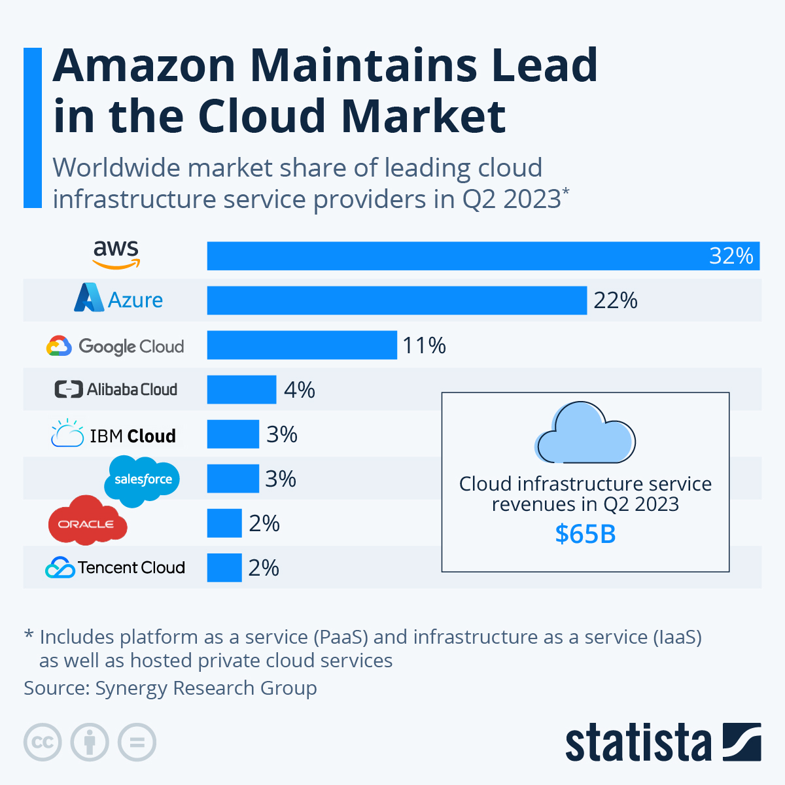
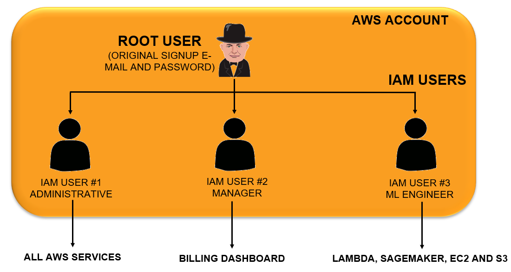

# Amazon Web Services (AWS)

## Cloud Computing

- Cloud Computing is the on-demand delivery of services such as computing and storage over the internet with pay-as-you-go pricing.
- Simply put; instead of buying a physical server or a computer, we can lease it.
- We can leverage compute power, storage, and databases on an as-needed basis from a cloud provider like AWS.
- Benefits of Cloud Computing:
  - Agility
    - Cloud Computing empowers companies to be agile and experiment with new ideas.
    - Instead of buying physical hardware/software and setting them up which might take months, cloud computing gives companies access to compute/storage/ml that enables faster innovation.
    - Companies can provision and deploy resources.
  - Elasticity
    - Cloud computing allows for scaling and shrinking resources based on demand.
    - No need to over provision resources up front.
  - Cost savings
    - Cloud computing trades capital expenses such as buying physical servers for variable expenses.
    - Massive savings with economies of scale.
  - Deploy globally in minutes
    - AWS infrastructure is available globally and companies can deploy services anywhere in minutes.
    - Placing applications near the customer is critical to improve latency and improve.

## AWS

- Amazon Web Service (AWS) is the world's top cloud platform.
- It offers more than 200 fully featured services.
- AWS enables companies to be more agile, flexible, secure at a fraction of the cost.
- AWS provides services for a broad range of applications.

### Regions And Availability Zone

- AWS spans over 102 Availability Zones (Data Centers) within 32 geographical regions.
- Region:
  - An AWS Region is a geographical location that contains a number of availability zones.
  - Every region is physically separate from all other regions.
  - Every region has its own independent power and water supply.
  - Regions are important to ensure:
    - Data Compliance
    - Latency (data centers are placed closed to users to reduce latency)
  - **us-east-1** is the largest AWS region and contains of six zones.
- Availability Zone:
  - An AWS Availability Zone is a logical data center located in a certain region.
  - There are two or more availability zone zones in every AWS region.
  - To ensure availability and reduce the likelihood of having two zones going down at the same time, each zone has a redundant and separate power and networking.
  - A Data center consists of a bunch of networks.
  - Each zone is backed by one or more physical data centers.

### Identity and Access Management (IAM)

- AWS Identity and Access Management (IAM) allows users to securely access and manage AWS services.
- IAM controls who is authenticated and authorized to use AWS services and resources.
- **Authentication**: Means who can log in the account.
- **Authorization**: Means what can be done inside a given AWS account.
- AWS IAM is a free global service, so no need to define a region.
- IAM allows us to create AWS users/groups and give/deny them access to AWS services.
- AWS Root account is the account we create with our email address and password. Root account has full administrative access, and it is very risk to use it at all time.
- AWS recommends to never use the root user for everyday work. Instead, create an IAM user and then lock away root user credentials.
- An extra layer of security using Multi-Factor Authentication (MFA) should be added.
- Granular level permissions can be assigned to the IAM users.

