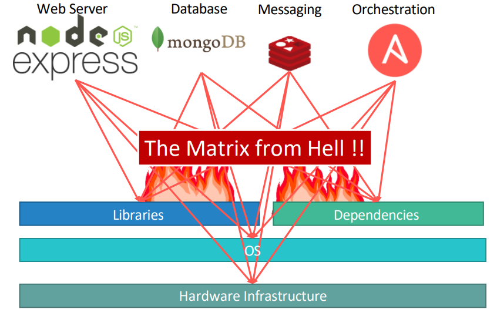
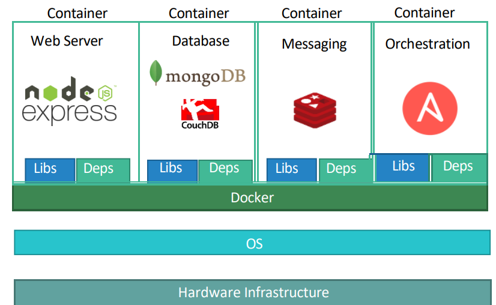

# Kubernetes

- Built by Google. Now an Open-Source.

## Containers

- Need for containers:
  - Compatibility/Dependency.
  - Long setup time.
  - Different Dev/Test/Prod environments.

- Containers are completely isolated environments.