# Fundamentals of Data Engineering

## What is Data Engineering?

**Think about it...As per you, what data engineers do?**

- "Data Engineering is the development, implementation, and maintenance of systems and processes that take in raw data and produce high-quality, consistent information that supports downstream use cases, such as analysis and machine learning. Data engineering is the intersection of security, data management, DataOps, data architecture, orchestration, and software engineering."
- "Get data from sources, do something useful to it, serve it."
- Data Engineering lifecycle:

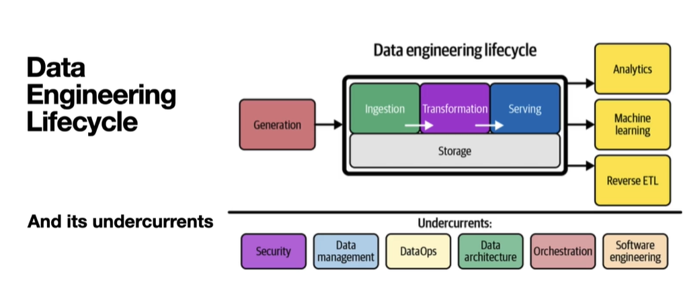

- *What is unlikely to change in 5–10 years?*

### Brief History of Data Engineering

- Database Management Systems.
  - Timeframe: 1960s and 1970s
  - Various types of databases.
  - Relational database and data model: Ted Codd at IBM
  - Ways to interface with databases: SQL.
- Data Warehouse
  - Timeframe: 1980s and 1990s
  - Transactional -> Analytics
  - Data warehouse architecture: Bill Inmon
  - Dimensional data model: Ralph Kimball
  - Analytics and Business Intelligence (BI)
- Business Intelligence and Analytics
  - Timeframe: 1990s and 2000s.
  - The internet and the Worldwide web.
  - Broadband internet connections.
  - 'Web Scale Data'
  - New Approaches: Hadoop, NoSQL databases, etc.
  - Big Data: 3 V's. Volume, Velocity and Variety.
    - Volume
      - Amount or size of data that organization is dealing with at a given time.
      - May range from GB to PB or even more.
      - Challenges in storing, processing, and analyzing high volumes of data.
      - Popular social media platform processing TB of daily data.
      - Retailers collecting years' worth of transaction data.
    - Velocity
      - Refers to the speed at which new data is generated, collected and processed.
      - High velocity requires real-time or near-real-time processing capabilities.
      - Rapid ingestion and processing can be critical for certain applications.
      - Sensor data from IoT devices streaming readings every millisecond.
      - High-frequency trading systems where milliseconds can make difference in decision-making.
    - Variety
      - Refers to different types, structures and sources of data.
      - Data can be structured, semi-structured or unstructured.
      - Business analyzing data from relational databases(structured), emails(unstructured) and JSON logs.
      - Healthcare systems collecting data from EMR, wearable health devices and patient feedback forms.
- Data Science
  - Timeframe: 2000s to mid 2010s
  - New tools and techniques for handling data, big and small
  - Machine Learning became popular.
  - Data Science involves ML, predictive and prescriptive analytics and more.
- Rise of Data Engineering
  - Timeframe: mid 2010s to present
  - Data Scientists spend a lot of time on non-data science work.
  - Machine Learning and Analytics goes mainstream.
  - Big Data tools become more accessible and easy to use.
  - How to provide a foundation for data science and analytics? *Data Engineering*
- Data Engineering today
  - Tools and practices are much simpler than the *Big Data* era.
  - Data Engineering is a hot and growing career field.
  - Abstraction = Data Engineers move up the value chain.
  - Data Engineering = Lifecycle Management.
- Landscape
  - MAD 2023: https://mad.firstmark.com/, Article: https://mattturck.com/mad2023/
  - MAD 2021: https://mattturck.com/wp-content/uploads/2021/12/2021-MAD-Landscape-v3.pdf, Article: https://mattturck.com/data2021/

### Who is a Data Engineer?

- A Data Engineer:
  - Designs, builds and maintain data infrastructure.
  - Manages the data engineering lifecycle.
  - Ensure that data is available, reliable and ready for use in analytics, ML/AI and other data use cases.
- Tasks:
  - Designing and building data pipelines to collect data from various sources.
  - Building and managing data warehouses and data lakes.
  - Cleaning, modeling, and transforming data to make it consistent and usable.
  - Developing datasets for data analysis and data science.
  - Writing and managing data orchestration workflows.
- A Data Engineer manages the following aspects of the data engineering lifecycle:
  - Data creation in source systems.
  - Ingestion.
  - Storage.
  - Transformation.
  - Serving.

### Upstream and Downstream Stakeholders.

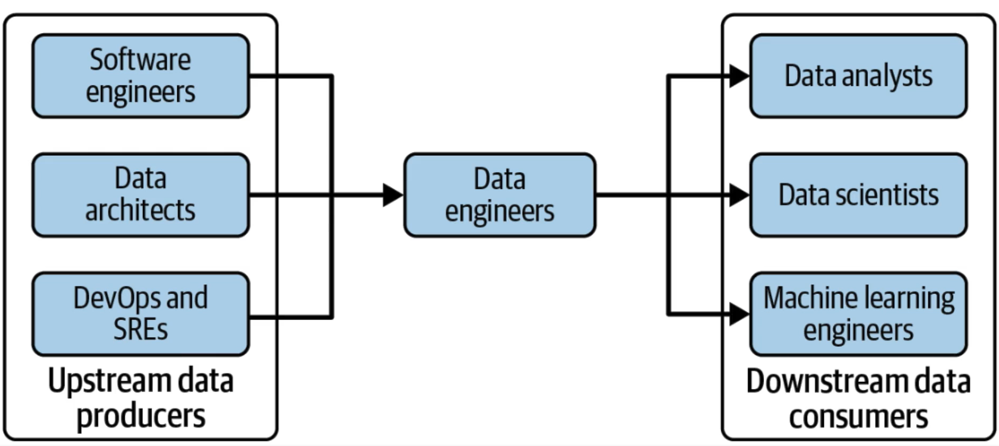

1. **Software Engineer & Data Engineer**
    - A Software engineer typically
      - Sits upstream from a data engineer.
      - Designs, develops and tests software systems and applications.
      - Maintains the source systems that data engineers depend on.

2. **Data Engineer & Data Scientist**
   - A Data Scientist typically
     - Often sits downstream from a data engineer.
     - Uses data to solve business problems.
     - Rely on the systems and data provided by data engineers.

- Data Science Hierarchy of Needs: https://hackernoon.com/the-ai-hierarchy-of-needs-18f111fcc007

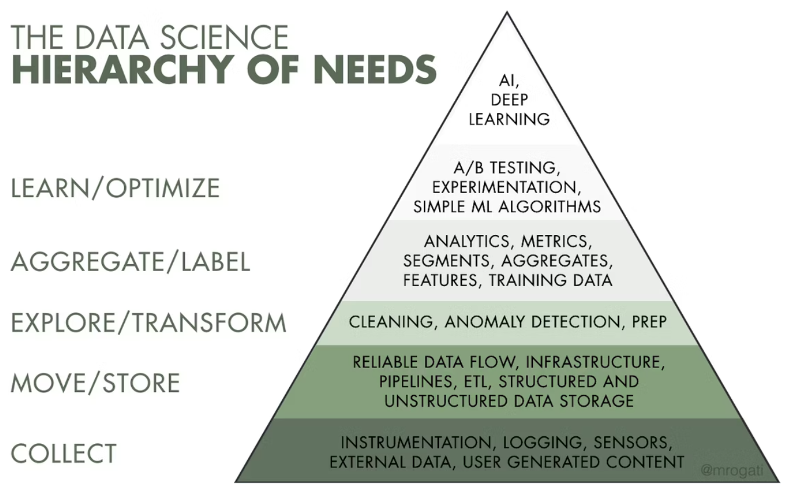

### Data maturity model

**Stage 1: Starting with Data.**

**Stage 2: Scaling with Data.**

**Stage 3: Leading with Data.**

## Data Engineering Lifecycle

- Data Engineering lifecycle is a subset of Data lifecycle.
- Data lifecycle encompasses data across entire lifecycle, data engineering lifecycle focuses on stages that data engineers controls.
- Data Lifecycle Components:
  - Creation
  - Capture
  - Preparation
  - Usage
  - Archival
  - Deletion

### Stages of Data Engineering Lifecycle

#### 1. Data Generation from Source Systems.

- Every digital process generates data.
- Examples: databases, application servers, raw files, APIs, IOT devices, social media and ecommerce platforms, cars, and many more.
- Raw data from source systems is often complex and messy.

#### 2. Data Ingestion.

- Extract data from various source systems, move it, and prepare it for further use or storage.
- Batch or real-time ingestion.
- Might involve cleaning and data validation steps.
- From here, data can be stored, transformed, and served.

#### 3. Data Storage.

- Saving data in an organized and easy-to-understand manner that allows for easy retrieval.
- Several ways to store data: Relational database, File System, Blob storage, NoSQL database, Data Warehouse or data lake, and many more.
- Goal: Ensure data is easily accessible, secure, and organized.

#### 4. Data Transformation

- Data mutates and evolves into something different.
- Integrate other data sources.
- Convert to a state useful for analysis, machine learning and other downstream use cases.

#### 5. Serving Data

- Serve data to users and applications in a format ready for consumptions and use.
- Examples: Analysis, Predictive Modeling, Machine Learning, reverse ETL, data-powered applications, and more.

## The Undercurrents of Data Engineering

- The undercurrents are the glue that holds the data engineering lifecycle together.

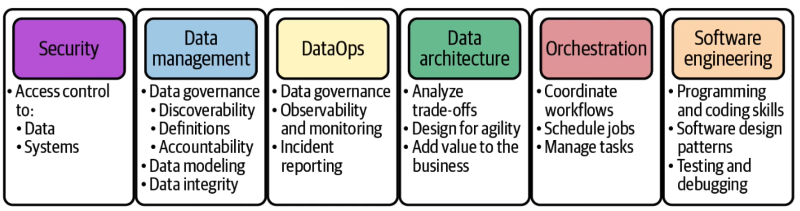

#### 1. Security

- Security must be a top priority throughout the data engineeringlifecycle.
- Security starts with YOU.
- Principle of the least privilege.
- Consider how security fits into how you handle data.
- Example: Encryption at rest and in transit, role-based access control (RBAC), tenancy.

#### 2. Data Management

- DAMA Body of Knowledge: Data Management is the development, execution, and supervision of plans, policies, programs, and practices that deliver, control, protect, and enhance the value of data and information assets throughout their lifecycle.
- Key areas important for data engineers:
  - Data Governance
  - Data Modeling and Design
  - Data Lineage
  - Storage and Optimization
  - Data Integration and Interoperability.
  - Data Lifecycle Management.
  - Ethics and Privacy.

#### 3. DataOps

- Key components: Automation, Observability and monitoring, Incident Response.

#### 4. Data Architecture

#### 5. Orchestration

- Key components:
  - Time or event-based
  - Efficient Task Management
  - Automated Error Handling
  - Scalability
  - Monitoring and Alerting
  - Directed Acyclic Graph (DAG)
- DAG
  - Graphs, Vertices and Edges.
  - Represents a series of activities.
  - No cycles or looping back on itself.
  - Driven by time or an event.
- Orchestration is not just a nice to have. It is key to making data engineering work.

#### 6. Software Engineering

- Software Engineering is the application of engineering principles to the design, development, testing and maintenance of software. It is a systematic approach to software development that aims to create high-quality, reliable and maintainable software.
- Many 'data' systems are software systems.
- Not just about 'coding Python or Java'
- General purpose of problem-solving.
- A Data Engineer should be able to write clean, readable and performant software.
- Test and debug code and systems.
- Design, Develop and maintain software.

## Data Architecture

- DMBOK describes: "Identifying the data needs of the eneterprise and designing and maintaining the master blueprints to meet those needs. Using master blueprints to guide data integration, control data assets, and align data investments with business strategy."
- TOGAF describes: "A description of the structure and interaction of the enterprise's major types and sources of data, logical data assets, physical data assets, and management resources."
- Joe Reis & Matt Housley: "Data Architecture is the design of systems to support the evolving data needs of an enterprise, achieved by flexible and reversible decisions reached through a careful evaluation of trade-offs."
- The Data Architecture is NOT:
  - The Data itself.
  - The tools and technology you use.
  - A one-time project.
  - Static.
- Major Architecture Concepts:
  - Domains and Services
  - Distributed systems, Scalability, and Designing for failure.
  - Tight vs Loose Coupling.
  - Greenfield vs Brownfield Architecture.

### Domains and Services:
- Domain: A Sphere of Knowledge, influence or activity. The subject area to which the user applies a program is the domain of the software.
- When architecting, it's critical to know what we are designing.
- Services: A Set of functionality whose goal is to accomplish a task.
- Example: Sales and Accounting Domains.

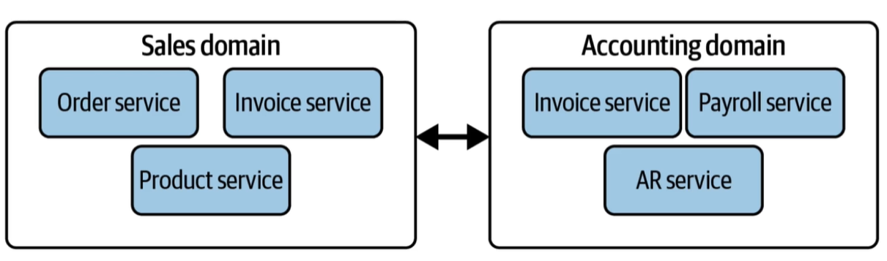

### Distributed Systems, Scalability and Designing for Failure.

- Everything eventually fails.
- Distributed system: More than one point of failure, with built-in redundancy.
- Scalability: Increase system capacity.
- Elasticity: Automatically scale up and down based on workload.
- Availability: The percent of time a system is in an operational state.
- Reliability: The probability of a system meeting defined standards for its intended purpose.

### Tight vs Loose Coupling

- Tight Coupling: High Interdependence between systems.
- Loose Coupling: Systems are largely independent.
- Example: Monolith vs Microservices.

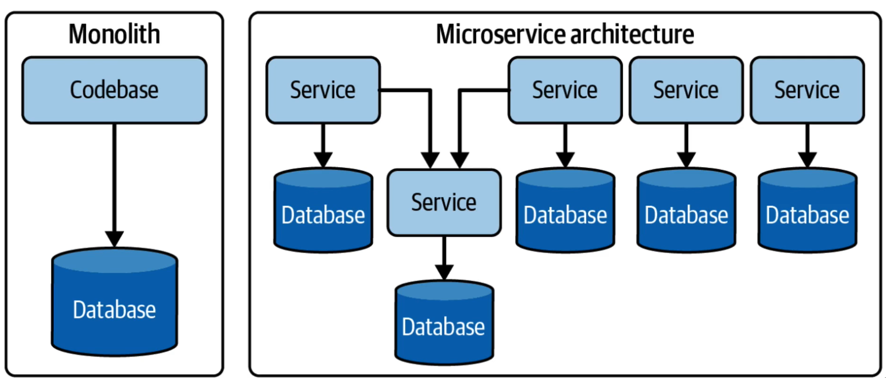

### Greenfield vs Brownfield Architecture

- Greenfield: A New system that is being built from scratch.
- Brownfield: An exiting system that is being updated or modified.
- Evaluate the trade-offs of each approach.

## Types of Data

### Structured Data

- Data that is organized in a defined manner or schema, typically found in relational databases.
- Characteristics:
  - Easily queryable.
  - Organized in rows and columns.
  - Has a consistent structure
- Examples:
  - Database tables.
  - CSV files with consistent columns.
  - Excel Spreadsheets.

### Unstructured Data

- Data that doesn't have a predefined structure or schema.
- Characteristics:
  - Not easily queryable without preprocessing.
  - May come is various formats.
- Examples:
  - Text files without a fixed format.
  - Videos and Audio files.
  - Images.
  - Emails and word processing documents.

### Semi-Structured Data

- Data that is not as organized as structured data but has some level of structure in the form of tags, hierarchies, or other patterns.
- Characteristics:
  - Elements might be tagged or categorized in some way.
  - More flexible than structured data but not as chaotic as unstructured data.
- Examples:
  - XML and JSON files
  - Email headers (Have a mix of structured fields like date, subject, etc.)
  - Log files with varied formats.

## ETL Pipelines

- ETL stands for Extract, Transform, Load. It's a process used to move data from source systems into a data warehouse.
- Extract:
  - Retrieve raw data from source systems, which can be databases, CRMs, flat files, APIs, or other data repositories.
  - Ensure data integrity during the extraction phase.
  - Can be done in real-time or in batches, depending on requirements.
- Transform:
  - Convert the extracted data into a format suitable for the target data warehouse.
  - Can involve various operations such as:
    - Data Cleansing
    - Data Enrichment
    - Format changes
    - Aggregations or Computations
    - Encoding or decoding data
    - Handling Missing values.
- Load
  - Move the transformed data into the target data warehouse or another data repository.
  - Can be done in batches or in streaming manner.
  - Ensure that data maintains its integrity during the loading phase.
- Managing ETL pipelines:
  - The Process must be automated in some reliable way.
  - AWS Glue
  - Orchestration Services:
    - EventBridge
    - Amazon Managed Workflows for Apache Airflow.
    - AWS Step Functions
    - Lambda
    - Glue Workflows

## Source Systems

- Main Ideas:
  - Files and Unstructured data. (CSV, TXT, JSON, XML)
  - APIs
  - Application Databases
    - Typically, its OLTP (Online Transaction Processing) System.
    - OLTP databases support low latency and high concurrency.
    - OLTP are less suited to use cases where analytics is done on scale.
    - ACID
      - Atomicity, Consistency, Isolation, Durability.
      - Atomicity or Atomic Transaction is a set of several changes that are committed as a unit.
      - 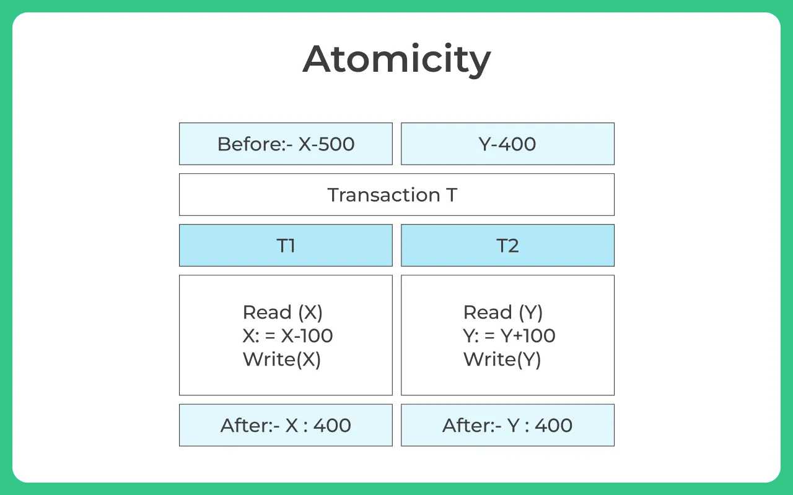
      - Consistency means that any database read will return the latest written version of the retrieved item.
      - Isolation: If two updates are in flight concurrently for the same thing, the end database state will be consistent with the sequential execution of these updates in the order they were submitted.
      - Durability indicates that committed data will never be lost, even in the event of power loss.
    - In contrast to an OLTP system, an OLAP (Online Analytical Processing) system is built to run large analytics queries and is typically inefficient at handling lookups of individual records. 
  - Change Data Capture (CDC)
    - Method of extracting each change event(insert, update, delete) that occurs in the database.
    - Handled differently depending on the database technology.
  - Logs
    - Captures information about events.
    - Few sources of logs: OS, Applications, Servers, Containers, Networks, IoT devices.
    - All logs track events and event metadata.
    - At minimum, a log should capture: *Who*, *What happened*, *When*.
    - Log encoding: Binary-encoding logs, Semi-structured logs (JSON), Plain-text logs.
  - CRUD
    - Create, Read, Update, Delete.
    - A Transactional pattern used in programming that represents four operations of persistent storage.
    - It is most common pattern for storing application state in a database.
  - Insert-Only
    - It retains history directly in a table containing data.
    - Instead of updating records, new records get inserted with a timestamp.
  - Messages and Streams
    - Messages
      - A Message is raw data communicated across two or more systems. 
      - These systems could be different microservices, a server sending a message to a serverless function, etc. 
      - A Message is typically sent through a message queue from a publisher to consumer.
      - Messages are discrete and singular signals.
    - Stream
      - It is an append-only log of event records.
      - Streams are ingested and stored in event-streaming platforms.
      - As events occur, they are accumulated in an ordered sequence.
      - Streams are used when we care about what happened over many events.

### Databases

- A Database is a collection of data that is organized and stored for efficient retrieval and manipulation.
- Considerations:
  - Database management System.
  - Lookups.
    - How does the database find and retrieve data?
    - Know whether database uses Index.
    - Basic Knowledge of major types of Indexes, including B-Tree and log-structured merge-trees (LSM)
  - Query Optimizer
    - Does the database utilize an optimizer?
  - Scaling and Distribution
    - Does database scale on demand?
    - What scaling strategy does it deploy?
    - Horizontal scaling(more database nodes) or vertically scaling(more resources on single machine)
  - Modeling Patterns
    - Data Normalization or Wide Tables.
  - CRUD
    - How is data queried, created, updated and deleted in the database?
  - Consistency
    - Fully consistent, relaxed consistency?
- Common types of database source systems:
  - Relational Database
  - NoSQL
    - Key-value
    - Document
    - Wide-Column
    - Graph
- Relational Database:
  - A Table structured with rows and columns.
  - Predefined schema.
  - Row: represents a single record.
  - Column: represents an attribute.
  - Keys: Primary and Foreign Key.
  - ACID Compliant
  - Vertically Scalable.
  - Interface is often SQL.
- NoSQL
  - Flexible Data Model/Schema less.
  - Fast Data Access.
  - Great for simple queries.
  - Most don't support ACID transactions.
  - Horizontally Scalable
  - Key-Value:
    - Key:
      - Can be any binary sequence
      - Must be unique.
      - Can be generated by algorithms
    - Value:
      - Always associated with a key.
      - Retrieve, Set, Delete a value by Key.
      - Numbers, Strings, JSON, Images.
      - Size restrictions.
    - Examples:
      - Redis
      - DynamoDB
      - Riak
      - Project Voldemort
    - Use cases
      - User Session
      - User Profiles and User Preferences
      - Shopping carts
      - Real time recommendations
      - Advertising
  - Document Database
    - Documents
      - Set of key-value pairs.
      - Keys: strings
      - Values: numbers, strings, booleans, arrays or objects.
      - formats: JSON, BSON, YAML, XML
      - Documents are analogous to rows in a relational database.
      - Documents are polymorphic i.e documents within same collections dont need to have same structure.
    - Collections
      - Sets of documents
      - Analogous to tables in relational database.
    - Examples
      - MongoDB
      - DynamoDB
      - Couchbase
      - Firebase
    - Use cases
      - Catalogs
      - Event logging
      - User profiles
      - Content management system.
      - Real time analysis.
  - Graph Database
    - Treat data and its relationship with the same importance.
    - Based on graph theory.
    - Detail understanding: https://graphacademy.neo4j.com/

### APIs
  - API: Application Programming Interface
  - Used to access data from applications or 3rd parties.
  - Common types of APIs
    - REST
      - Popular protocol
    - GraphQL
      - Specify exactly what data you need from the server, without having to make multiple requests.
  - REST
    - REpresentational State Transfer.
    - Interactions are stateless.
    - REST call is independent.
    - REST calls can change the system's state, but these changes are global rather than current session.
  - GraphQL
    - More flexible and expressive queries than with the REST.
    - REST APIs generally restrict queries to a specific data model, GraphQL opens up possibility of retrieving multiple data models in a single request.
  - Webhooks
    - Event-based data-transmission pattern.
    - When specified events happen in the source system, it triggers a call to an HTTP endpoint hosted by the data consumer.
  - RPC and gRPC
    - A Remote Procedure Call is commonly used in distributed computing.
    - gRPC is a remote procedure call library.
    - It emphasizes the efficient bidirectional exchange of data over HTTP/2.

### Message Queues and Event-Streaming Platforms
  - Message Queue
    - Asynchronously send small messages between discrete services using a publish and subscribe model.
    - Useful for decoupling services from each other.
  - Event-Streaming Platform
    - Similar to message queue, but used to ingest and process data in an ordered log of records.
    - Producers send events to topics, which are consumed by subscribers.

### Undercurrents for Storage
- Security: Data encrypted at rest and during transmission, keep API keys and database passwords secret.
- Data Management: Understand how data is managed in the source system.
- DataOps: Clearly communicate with stakeholders and set up observability.
- Data Architecture: Understand upstream architecture.
- Orchestration: Make Sure orchestration and dependencies can access the source system.

## Ingestion

- Process of moving data from one place to another.
- "A Data Pipeline is the combination of architecture, systems and processes that move data through the stages of the data engineering lifecycle."
- Key Concepts for Data Ingestion:
  - Bounded vs Unbounded Data.
  - Batch vs Streaming.
  - Sync vs Async.
  - Push vs Pull.
  - Schema Changes.

### Bounded vs Unbounded

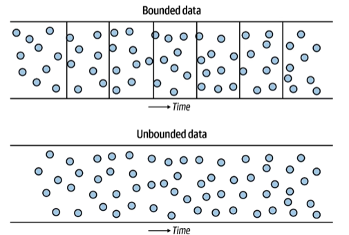

- Unbounded: Data continuously flows.
- Bounded: Bucketing data, dividing into chunks for processes.

### Batch vs Streaming

- Batch: Fixed Intervals (data size or time based)
- Streaming: Continuously flowing data
- Most of the time, Streaming and Real-time are used interchangeably.

### Schema Changes

- What happens if the schema in your source system changes?
- Pipelines might break...
- Especially problematic: column deletion or column name changes.
- Solutions:
  - Observability
  - Data Contracts.
  - Communicate with source system stakeholders.

### Undercurrents

- Security: Encryption in transit and at rest.
- Data Management: Schema changes, handling sensitive data.
- DataOps: Set up observability and monitoring for your datapipelines, data quality tests.
- Data Architecture: Build for resiliency and failure.
- Orchestration: Consider dependencies in your pipelines.
- Software Engineering: Avoid writing code that has a lot of tight dependencies.

## Transformations

- A Query allows you to retrieve and act on data.
- Types of a query:
  - Select: Retrieve data
  - Action: Update or Delete data
- Life of a query: `SQL query issued -> Parsing and conversion to bytecode -> Query Planning and Optimization -> Query execution -> Results returned`
- Query Optimizer
  - Optimizes query performance.
  - Explain plan: Helpful for diagnosing queries.
    - Shows the execution plan chosen by the dataset optimizer for a specific query.
    - An execution plan is a sequence of steps that the database will take to execute the statement.
    - Useful for understanding performance issues with a query.
- Data Modeling
  - A Data model represents the way data relates to the real world.
  - A good data model captures how communication and work naturally flow within your organization.
  - A poor data model results in haphazard, confusing and incoherent data.
  - Often overlooked by data professionals.
  - Stages of Data Modeling:
    - Conceptual: High level understanding of how data and concepts relate. No technical detail.
    - Logical: Intermediate step of transforming the conceptual model into a structure.
    - Physical: Database implementation and optimization of the logical model.
  - Normalization
    - A good practice to make sure we have removed redundancies and understand the relationships in our data.
    - Especially helpful with relation databases.
    - Levels of normalization: 1NF, 2NF, 3NF, Boyce-Codd NF
    - Based on set theory and first order predicate logic.
    - Check Paper: https://www.seas.upenn.edu/~zives/03f/cis550/codd.pdf
- Analytical Data Modeling Approaches
  - Dimensional
  - Data Vault.
  - One Big Table (OBT)
  - Just a Bunch Of Tables (JBOT)
  - 'Query-driven modeling'
- Views
  - View: A Virtual table that is created from a query.
  - Materialized view: A Physical table that is created from a query.
- ELT vs ETL

### Undercurrents of Transformation

- Security: Principle of the least privileges to systems and data.
- Data Management: Data Privacy and Masking, Data Lineage, Data Model Integrity.
- DataOps: Data Quality and System Monitoring.
- Data Architecture: Ensure for easy querying and data processing.
- Orchestration: Event vs Time Based.
- Software Engineering: Write Clean code and make it easy to manage.

## Storage

- Phases of Storage.

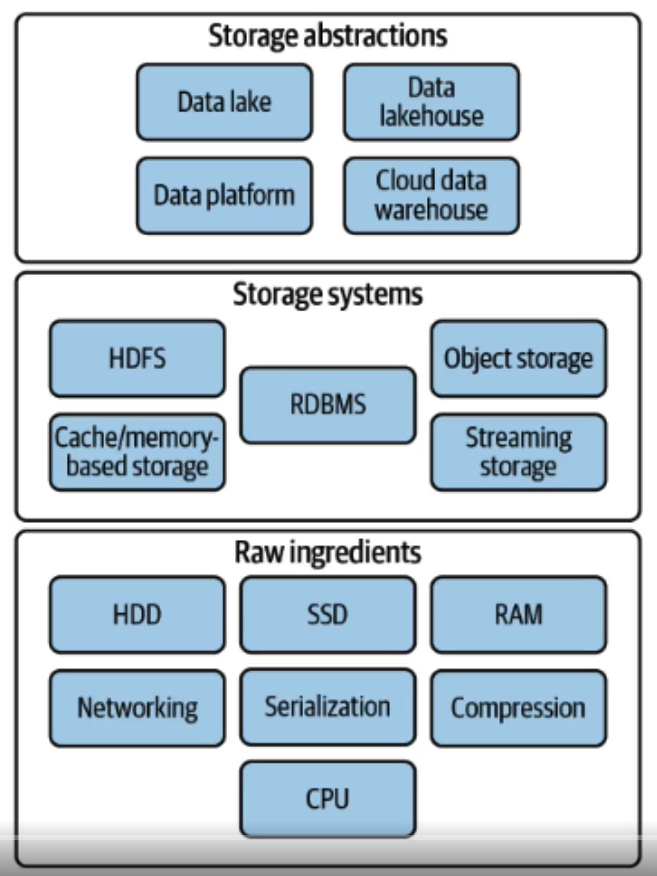

- Raw Ingredients
  - Disk storage types: HDD, SSD
  - RAM
  - CPU
  - Networking
  - Serialization
  - Compression
- Disk Storage vs RAM
  - Disk Storage
    - HDD: Hard disk drive
    - SSD: Solid-state drive
    - Slower data access than RAM
    - Non-volatile: Data is preserved when power is turned off.
  - RAM
    - Short-term memory
    - Fast data access
    - Volatile: Data is lost when power is turned off.
  - Common Storage Systems
    - RDBMS and other databases
    - Object Storage
    - Cache/memory-based
    - Streaming storage
    - HDFS - Hadoop File System
- Object Storage
  - Manages data as objects
  - Objects have
    - Data
    - Unique Identifier
    - Metadata
  - Extremely common for Data Engineering workloads
  - Popular Object storage: AWS S3, Azure Blob Storage, GCP Cloud Storage

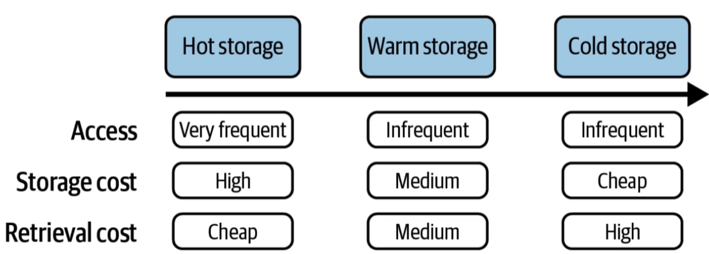

  - Object Storage has varying costs associated with different storage tiers
    - AWS S3
      - Regular (hot): $0.02/GB
      - Infrequent Access (warm): $0.01/GB
      - Glacier (Cold): $0.004/GB

- Storage Abstractions
  - Data Warehouse
  - Data Lake
  - Data Lakehouse
  - Data Platform
- Data Warehouse
  - A Data warehouse is a "subject-oriented, non-volatile, integrated, time-variant collection of data in support of management's decision."
  - It's a centralized repository optimized for analysis where data from different sources is stored in a structured format.
  - Goal: Separate Analytical and Transactional workloads.
  - Designed for complex queries and analysis.
  - Typically, uses a Star or Snowflake Schema. https://en.wikipedia.org/wiki/Star_schema, https://en.wikipedia.org/wiki/Snowflake_schema
  - Extremely common in organizations of all sizes.
  - Components of Data Warehouse:
    - Operational Source System
    - ETL: Extract, transform, and Load
    - Data mart
    - Data Warehouse
  - Examples:
    - Amazon Redshift
    - Google BigQuery
    - Microsoft Azure SQL Data Warehouse.
- Data Lake
  - A Storage Repository that holds vast amounts of raw data in its native format, including structured, semi-structured, and unstructured data.
  - Can storage large volumes of raw data without predefined schema.
  - Data is loaded as-is, no need for preprocessing.
  - Supports batch, real-time, and stream processing.
  - Can be queried for data transformation or exploration purposes.
  - Examples:
    - Amazon S3(Simple Storage Service) when used as data lake.
    - Azure Data Lake Storage.
    - Hadoop Distributed File System.
- Comparison:
  - Schema:
    - Data Warehouse: Schema-on-write. ETL
    - Data Lake: Schema-on-read. ELT
  - Data Types:
    - Data Warehouse: Primary Structured Data
    - Data Lake: Both Structured and Unstructured Data
  - Agility:
    - Data Warehouse: Less Agile due to predefined schema.
    - Data Lake: More Agile as it accepts raw data without predefined schema.
  - Processing:
    - Data Warehouse: ETL
    - Data Lake: ELT
  - Cost:
    - Data Warehouse: Typically more expensive because of optimizations for complex queries.
    - Data Lake: Cost-effective storage solutions.
  - Usage:
    - Data warehouse:
      - You have unstructured data sources and require fast and complex queries.
      - Data ingestion from a different source is essential.
      - Business Intelligence and Analytics are primary use case.
    - Data Lake:
      - You have a mix of structured, semi-structured o unstructured data.
      - You need a scalable and cost-effective solution to store massive amounts of data.
      - Future needs of data are uncertain, more flexibility is required.
      - Advanced analytics, ML or data discovery.
- Data Lakehouse
  - Hybrid data architecture that combines the best features of data warehouses for performance, reliability and capability while maintaining flexibility, scale and low-cost storage of data lakes.
  - Supports both Structured, Unstructured Data.
  - Allows for schema-on-write and schema-on-read.
  - Typically built on top of cloud or distributed architectures.
  - Benefits from technologies like Delta Lake, which brings ACID transactions to big data.
  - Examples:
    - AWS Lake Formation (with S3 and Redshift Spectrum)
    - Delta Lake: Open-Source storage layer on top of Apache Spark.
    - Databricks Lakehouse Platform.
    - Azure Synapse Analytics.

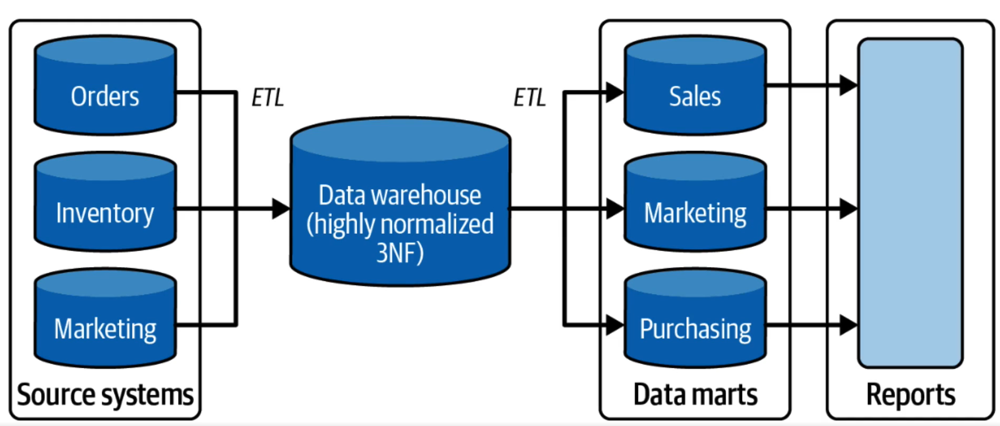

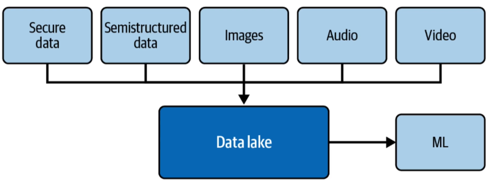

### Undercurrents of Storage

- Security: Encryption at rest, Role based access control, column and row-level protection.
- Data Management: Data Catalogs, Data Versioning, Privacy
- DataOps: Monitoring and observability
- Data Architecture: Build for resiliency and failure.
- Orchestration: "Storage allows data to flow through pipelines, and orchestration is the pump."
- Software Engineering: Performant code and avoid coupling your code to storage. (Separate compute and Storage)

## Serving

- Data Engineering isn't done in a vacuum. Serving data ties data back to business use cases and adding value.
- Use cases: Analytics, Machine Learning and Reverse ETL.

### Analytics

- Analytics is the process of collecting, analyzing and interpreting data to gain insights that can be used to make better decisions.
- Goal is to turn data data into actionable insights.
- Business intelligence (BI)
  - Provides insights into the past and present.
  - Reports and dashboards
- Ad hoc analysis
  - Exploratory Data Analysis.
  - One-time answers.
- Business vs Operational Analytics
  - Business Analytics: Analyzing Historical data to glean insights, identify trends, and guide strategic decisions for long-term planning.
  - Operational Analytics: Real-time monitoring and optimization of business operations.
- Machine Learning
  - ML algorithms are trained on data, and then they can use that data to make predictions or decisions.
  - Things to know:
    - Difference between supervised and unsupervised learning.
    - Understand the basics of deep learning and 'classical' techniques.
    - Various approaches for different types of data:
      - Tabular Data: XGBoost, 'classical' techniques.
      - Unstructured Data: Various Generative AI Approaches.
- Reverse ETL

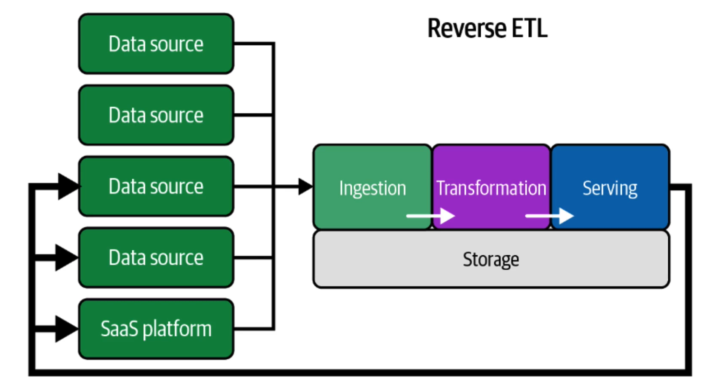

### Undercurrents of Serving.

- Security: Principle of the least privilege to systems and data.
- Data Management: Build TRUST in the data you serve.
- DataOps: Data Quality and Serving Monitoring.
- Data Architecture: Ensure for easy querying and data processing.
- Orchestration: Event vs Time-based.
- Software Engineering: Write Clean code and make it easy to manage.

## Data Mesh.