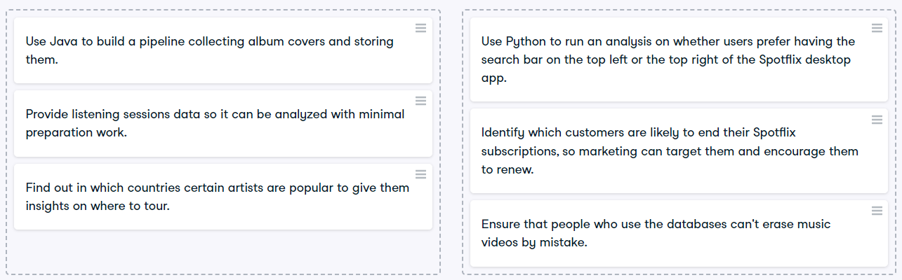
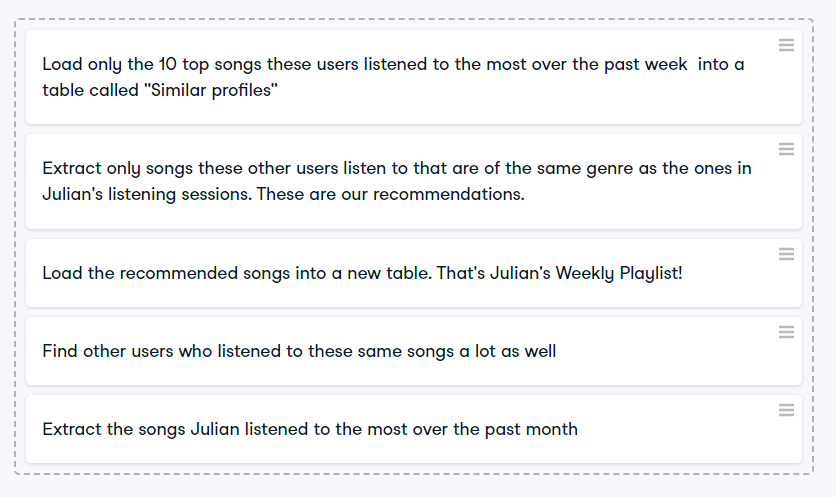
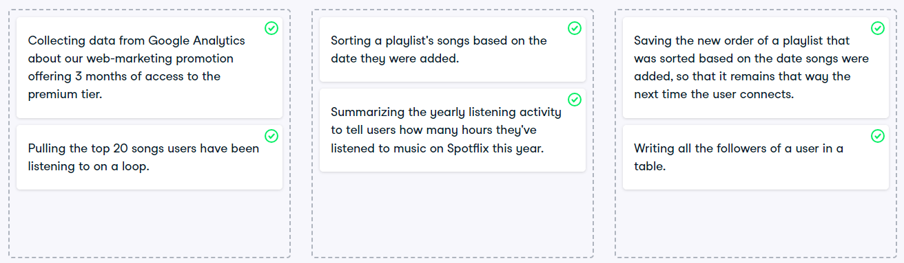

# Data Engineering understanding check

1. Below are several tasks related to working with data. Classify them in two buckets: one for data engineering tasks, one for tasks that are not the responsibility of data engineers.
   
2. What is the difference between ETL and Data Pipelines?
3. You are working on building new pipelines to generate a new product: the Weekly Playlist. It's a playlist created by your system every day to recommend new songs that users might like based on their tastes. 

    

4. Why is data catalog used with Data Lake?
5. Classify the below tasks as Extract, Transform, Load.
   
6. What is the difference between Vertical Scaling and Horizontal Scaling?
7. Enlist the differences between a CSV/TSV file and a Parquet file.